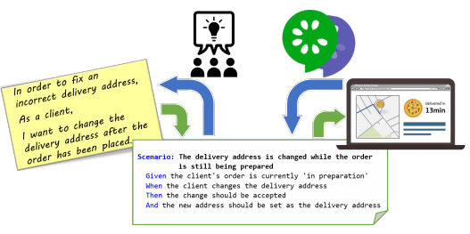
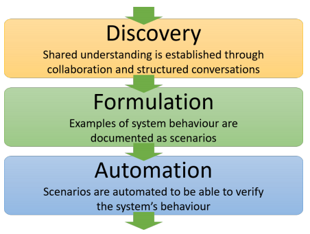
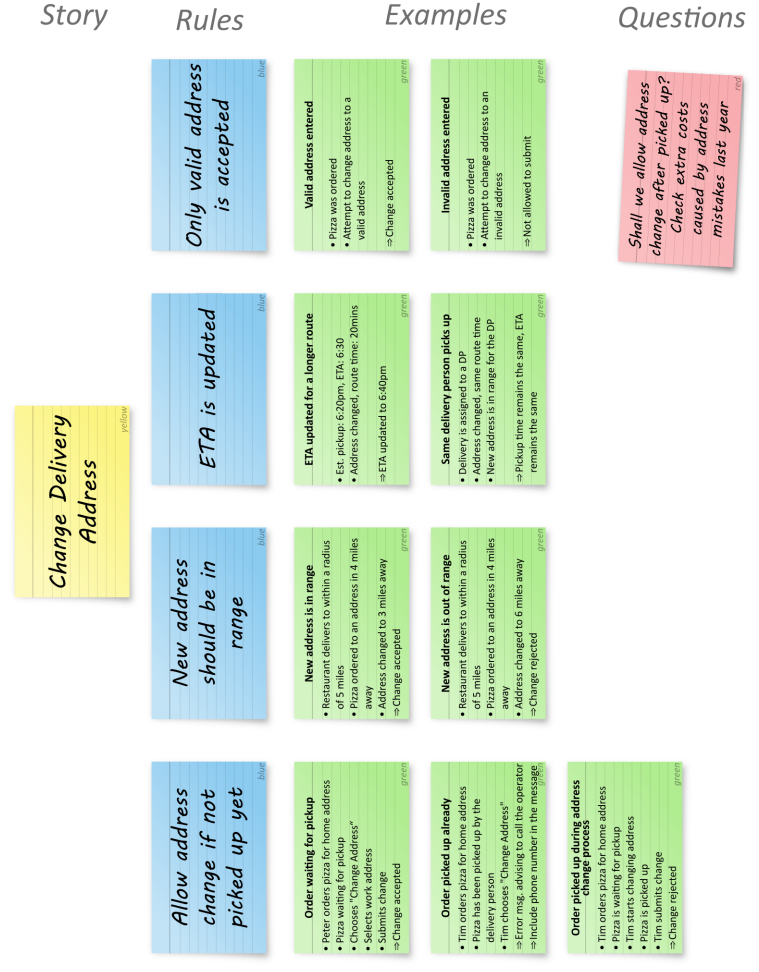
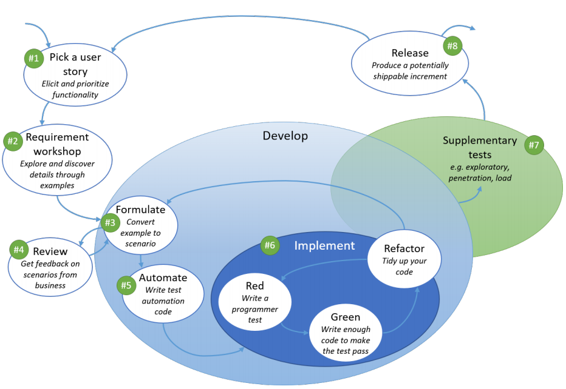
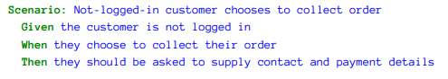
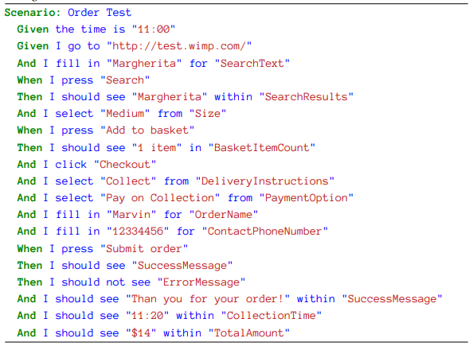

# 行为驱动开发 - Behavior Driven Development  

> 今天是2020.1.24日，大年三十，猪年的最后一天，谨以此文结束这充实的一年。祝读者鼠年吉祥

”行为驱动开发“这个名字是从英文直译过来，稍显奇怪，不知道有没有其它更好的翻译。下面用到的时候我就直接用BDD来指代了。

## 是什么，解决什么问题

肯定有很多人对BDD陌生，国内软件企业非常看重最终结果却不是特别重视过程，而BDD恰恰在过程这个领域，所以应用的不是特别广泛知道的人自然就少一些。**它是一种软件开发的开展方式，它保证在团队内创造针对需求的共识**，谈它挑战的问题的话需要从敏捷开始。敏捷开发想解决的问题是什么大家肯定多少都有了解，它减少从需求到反馈的时长，从而让软件更贴近市场，整个团队 - 包括PO - 频繁地对表，不让我们的工作偏离正确方向。一个正常的敏捷团队（以Scrum为例）必备如下角色：开发者，测试者，需求管理者（Product Owner），牵头人或者叫管家（Scrum Master）。日常工作的开展围绕那几个著名会议展开：Planning，Daily，Review， Retrospective，周而复始。PO给出的需求可以说是所有工作的前置条件，我在我的各个项目里每次都会化不少精力和PO建立如何定义好需求的共识，甚至格式是什么样子都会提前确定并不断根据教训加强，也会要PO在下一个项目周期前2天发出新的需求给团队。即使这样，我们的两周一次的Planning meeting也还是要开4个小时以上，大多讨论是理解需求，当然我们的PO和我们开发团队不在一个国家办公是造成额外开销的重要原因，但根本原因是人的思维方式太不同了，背景知识差异也太大了，一段PO觉得清楚无误的话开发看了就问题多多。你看，事实证明，**需求的传递并没有因为应用敏捷开发模式而变得完全无损**。其实人类社会早有手段应付这类问题了：正规化。例如USB接口的推广，wifi制式的统一，都是这个路子，大家做同一件事情的时候不要各行其是，按照约定好的规则来！**BDD为我们制定了一种需求理解的过程，它的产出是针对需求的正规化的再表述，一种简单明了的再表述**。

其实说到这里BDD的意义就说完了，就是理解需求用的过程，避免交流失误，最终统一全部成员的理解。但BDD流行起来的一个重要原因是有一拨人做了件特别NB的事情，咱上面说BDD会最终产出一种”针对需求的正规化的再表述“，这些人开发了软件工具，**把这些”再表述“和团队做的自动化测试用例关联了起来！**大家知道，测试用例的目标是发现软件实现与需求的不符合之处，是团队一个开发周期所产出成果的重要衡量尺度，那么**这种关联实际是完全自动化了”针对开发目标是否达成的评定“**。  
  
自动化就意味着我可以高频次地跑，如果自动化测试脚本能在开发周期中期完成，那么我们随时可以掌握团队地开发进度，有多少既定功能已经实现了一目了然；如果自动化测试脚本不够及时只能在开发周期末期完成，那么我们至少可以在那时通过它们快速做评定，机器机械地做毕竟比人带着很大不确定性去做更可靠；如果测试脚本只能在开发周期结束后才完成，那也不是没有好处，它们还可以被用于后续迭代地回归测试嘛。总之，这种关联使得我们在不断地迭代过程中随时掌握所有实现了的功能的当前状态，**这使得BDD产出了一份活的产品功能文档。** 这样的效果是很多软件团队都梦寐以求的，所以自动化也逐渐被纳入BDD的方法论，作为延申出现。

我们需要把BDD和“Test Driven Development”区分开。TDD是说我们开发代码要写测试用例在先，主要是单元测试，测试用例要先写并要认真写，体现你的目标方法所要实现的目标。虽然二者名字只有一词之差，但二者完全不同。首先它们解决的问题所在层次不同，BDD是需求理解方面，而TDD是开发工作的方式；其次它们的参与者不同，BDD要全员参与，而TDD主要是开发人员（程序猿）来执行；再有就是发生的时间不同，BDD是一个迭代周期开始的第一件事情，TDD那是已经动手去实现了。

我们不要误把BDD当成一种”自动化测试“的方法论。**如果谈主业，BDD就和测试没有任何关系**。误解来源于BDD社区实现了BDD针对需求的正规化表述和自动化测试脚本的连接，测试脚本是实实在在要落实在系统里面的东西，所以给团队的印象是”要用BDD了，我要写自动化测试“，于是一头扎进Feature file，cucumber这些东西中去。记住，”BDD“和”连接BDD的产出和自动测试“是两回事。

## BDD过程

在软件工程领域，成功的流程往往是简单的，BDD也不例外，至少看起来是简单的。概括来说，BDD有三步：  
  
+ 需求探索  
这一阶段整个团队坐在一起，用制定好的步骤来理解需求，具体方式下面展开。
+ 需求正规化  
需求理解完毕，那么我们需要用一种简洁正规，人与机器都能理解的方式表示出来。要求让机器也能懂主要是考虑到接下来的自动化。  
+ 自动化 （BDD的延申）  
基于得到的机器也能理解的需求表述，测试人员编织自动化测试脚本，最后通过工具（cucumber）的帮助，把脚本和需求表述连接起来。

## 第一步：需求探索

一切从PO的需求开始，一个迭代周期开始于对这些需求的分析。分析需要一些具体的形式，这一点很多团队实际上没有意识到的，我相信很多团队都只是坐在一个会议室里单纯地讨论，聊到哪里是哪里，理解是否完整全看当天状态。这种”朴素“的模式并非不会成功 - 如果我们的PO和团队始终呆在一起，如果你们有一个很棒的Scrum Master，能够时刻把大家的讨论方向聚焦，那么效果很有可能是有保证的，只是过程会痛苦一点儿而且Scrum Master本人非常痛苦，我自己深有体会。BDD里需求探索的工作在一个又一个”Requirement Workshop“里完成，在这个workshop中，**针对需求进行Structured Conversation，说白了就是有序讨论而不是叽叽喳喳**，例如团队可以使用”Example Mapping“的方式来进行需求理解，但并不强制使用Example Mapping，也可以用自己成熟好用的需求理解过程替代，重点是你们的讨论是“Structured”的。

所谓“Structured Conversation“，有如下特点：
+ 群策群力共同参与。最好包括PO的全员，大家是建设性讨论，而不是互相拆台，逞英雄
+ 思路多样，视角多样。不然大家从一开始结论都一致，没啥讨论的
+ 短。这样的讨论不要持续太长，耗尽了大家热情，例如每个Requirement Workshop不超过1小时
+ 注意向前推进。很多时候与会者都忘记了在讨论什么，组织者要及时把大家拉回来向前推进
+ 共识。最后我们要给出达成的共识是什么，确保每个人都理解了这些共识

我们来看看Example Mapping是怎么玩儿的。PO给的需求往往是一段文字，好一点儿的PO会指定明确验收标准，我们叫Acceptance Criteria；忙一点儿的PO的话可能就只有文字描述了。在进行Example Mapping时，组织者要求所有与会者给出反应该需求的一个个基于实际数据，功能的例子，例子的描述要包含三个部分：  
+ 背景信息（Context）  
你在软件上做这组操作前软件的状态，例如系统里已经有的数据。这里肯定只给出和你的例子特别相关的背景信息，而不是面面俱到给出所有，那些次要，显而易见的必备条件等，就不用再累述了  
+ 操作步骤（Action）
接下来你是怎么在软件上操作的呢？ 描述一下  
+ 结果，产出 （Output）  
你这一通操作下来，系统会产生什么结果？  

需求如果包含验收条件（Accept Criteria）那是极好的，我们在设想example的时候可以围绕这些AC有的放矢地举例子。如果很不幸需求没有明确的AC，或者我们发现需求里面给出的AC有遗漏，那么我们在给出一组例子后，就需要思考一下这些例子分别展示了怎样的功能要求呢，也就是说我们自己总结出AC，这很有意义。**在BDD里面我们叫AC为”Rule“，规则**。在需求正规化的工具里面为Rule留有专门的关键字。所以Rule介于需求描述和例子之间，很像是一组例子的总结概括。

在讨论过程中总会有些大家都无法回答的问题，包括PO也有可能无法回答那些事前没有想到的情况，我们把它们归类为”Question“和”Assumption“，问题和假设。

那么应用Example Mapping的Requirement Workshop会产出什么呢？如下：  
+ 需求，这其实不是产出，只是PO再述一下。会议室的白板上用黄色标签标识
+ Rule，规则。会议室的白板上用蓝色标签标识它们  
+ 归在各个Rule名下的Example。白板上用绿色标签标识它们，每一个example都包含背景，操作和结果三个部分  
+ Question和Assumption。用红色标签标识，会后我们要进一步明确它们  

  
上图给出一个书本上围绕”Pizza预定系统上，客户更改订单投送地址“这个需求的Example Mapping结果，给大家一个直观感受。  

#### 何时开展需求探索呢？  
这其实是个好问题。下面这张图也特别好，针对Scrum项目，它概括性地给出了各个BDD事件可以发生的时间点，不仅包含需求探索，还有之后各个步骤。  
  

我的感觉是不要太刻板套用BDD的描述，当然BDD人家自己也没在这方面做规定，只是很多书中的例子会给出自己的做法。我们完全可以利用在项目中已经被熟知的会议开展Example Mapping。例如在我们的Scrum项目里有Planning Event，又分为Global Planning （有PO参与）和Local Planning（除PO之外的项目组成员参加），我们是在Local Planning时进行的。  

也可以化整为零，就是不要搞特别长的Requirement Workshop，在当前迭代周期寻找可以利用的时间窗口把大家拉在一起，个把小时就可以来一次workshop，分析哪怕一个需求，这样积累下来很可能下个迭代周期的工作内容就有了。当然这需要PO的配合，能够提前比较长的时间给出下个迭代周期的需求，这个要求对很多项目组是挑战。  

## 第二步：需求正规化  

需求探索给了我们Rule，Example和Assumption，主体是Exmaple，我们接下来要把它们正规化地表述出来，这就是所谓”需求正规化“。  
正规化的基础是”[Gherkin](https://cucumber.io/docs/gherkin/reference/)“语法，这个语言语法本身非常简单，我不会展开讨论，只介绍影响你理解本文的部分。  

#### Gherkin速览  
+ Scenario： 在Gherkin语言里，一个探索阶段给出的Example被一个Scenario描述，而Scenario又由Given - When - Then三部分组成，可以大致映射到Example的Context - Action - Output。
+ Given: 描述重要的前置条件，只给和我们结果强相关的，那些显而易见的前置条件不必累述。 
+ When： 给出用户的活动
+ Then： 结果
+ Feature： Feature是最大的一个概念，一个Feature 可以包含多个Scenario。一般一个Feature会实在描述在一个文件中，就是著名的Feature File了。  

#### 什么样的Scenario是描述完好的呢
看过了Gerkin 语法我们聚焦到Scenario的撰写上来。好的Scenario会满足BRIEF原则：
+ Business Language  
尽量用Buisiness语言来表述，让项目组所有人，包括PO，Stakeholder等，都看得懂    
+ Real Data  
不要写空泛的语句，与其说”输入一个数字“不如说”使用10.1作为价格输入“  
+ Intention Revealing    
我们希望尽量用真实数据来描述，但不要针对那些无关紧要的细节过分使用数据，我们叫这样的数据为”Incidental Data“。我们始终聚焦在这个Scenario要体现的功能上，不偏离要点。  
+ Essential  
我们要时刻关注Example所在的Rule，我们的Scenario为的是展示那个rule，以此为原则去忽略其它细节。  
+ Focused  
我们每次只关注一个Rule。可能会出现一个Scenario既和rule 1有关，又和rule 2有关，那么我们可以考虑再写一个scenario，让它的描述去贴近另一个rule  

一个Scenario既是给人读的，也是给机器读的。实践过程中经常出现的情况是只兼顾机器的可读，因为后续我们要实实在在地把Scenario和测试用例关联起来，所以机器可读性天然被重视；而忽略BDD**改善人与人交流**方式从而无误理解需求的本质。我们在写Given - When - Then的时候要特别强调人的可读性，它的priority高于机器的可读性。好的Scenario是短小精炼的人类语句，过长的话需要考虑拆分。设想我们有一个对技术一无所知的PO，他读过一个Scenario后，是否能够马上给出判断：这个就是/不是我要的结果！是的话就是好Sceanrio。  

谈到Scenario的人类可读性要求就不得不提描述中的用语。BDD很推崇[Domain Driven Design](https://github.com/JackyZhangFuDan/Readings/blob/master/DomainDrivenDesign.md)中提及的Unbiquitous Language，每一个Bounded Context都会有一个自己的UL，它就像一个本项目组词汇库，它里面词汇代表的概念为大家所熟知。BDD希望我们项目建立自己的UL，并用UL中的词汇描述Scenario，

优秀的Scenario还是建立在实在数据的基础上的，其描述不空，不虚不抽象。在给出Given-when-then时，合理设订数据来展示功能；同时描述基于项目设定的用户角色（Persona），通顺而且有带入感。

由此可见写一个好的Scenario着实不易，不过我们整个团队不必从开始就达到很高水平，在实践中成长，向着目标逐步靠近就好。在文末提到的两本书里面有很好的撰写Scenario的指导，建议大家去阅读。一个书本上的Scenario例子：  
  

这里我要特别强调一下，**千万不要把Scenario写成自动化脚本式的操作流水账**，如果它变成了脚本执行过程的总结那么它基本失去了人与人交流的功能，更不要提形成”活文档“了。下面给出一个反面例子：  
  
这个Scenario完全符合语法要求，所以工具认它没有问题，但是人读下来肯定不知所云，太过繁琐，不必要的细节太多。

#### 正规化的产出  
经过了正规化这一步，我们把Example分别描述成了Scenario，这些Scenario会被集中组织在Feature File里面，这就是我们的产出。在后续步骤中，Feature File会被关联到自动化测试用例上。  下面是一个Feature File的例子。  
  
  

## 第三步：自动化

构建中......

## 参考资料  

这篇文章是我读了如下这个BDD系列书籍总结出的，一共三本，前两本加起来才160页，很容易读；第三本主要讲工具，如何自动化，所以对于搞软件的我们估计也不难消化（这本书目前作者正在写作中）。有时间读一读吧。
+ 《[The BDD Books - Discovery: Explore behaviour using examples](https://leanpub.com/bddbooks-discovery)》
+ 《[The BDD Books - Formulation: Express examples using Given/When/Then](https://leanpub.com/bddbooks-formulation)》
+ 《[The BDD Books - Automation with Specflow](https://leanpub.com/specflowbook)》