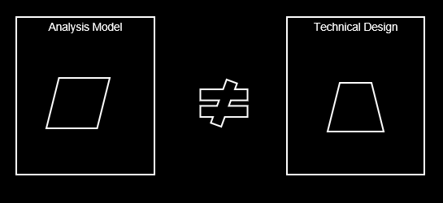
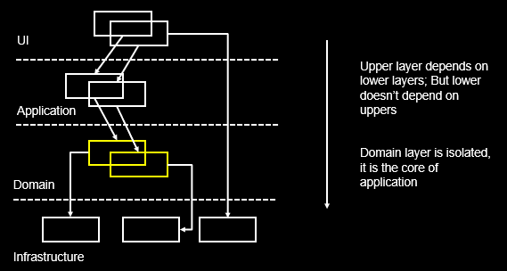

# 领域驱动设计 （Domain Driven Design）  
这个题目拖了很久了，一直没有时间把自己的学习和领会写下来，这都2020年了，完成它！本文主要内容来自Eric Ewens的《Domain Driven Design》一书，结合了我的一些理解和实践经验，希望对读者有帮助。同时这里你可以下载到我自己准备的用于培训的PPT，既然是PPT那内容肯定很粗略，但可以当个大纲看。  

大多数做微服务开发的同学对DDD这个名词肯定不会陌生，至少是听说过的。当我们面临从传统Monolithic系统转向微服务构架时，第一个问题就是怎么划分出微服务，它们之间如何关联，怎么进行全系统设计？数据一致性如何在微服务之间保持，微服务的“先民”们也不例外要面临这些问题，神奇的是大家忽然发现这些问题在Eric的DDD一书中都有讨论和结论，于是 DDD名声鹊起~现在到了谈微服务必谈DDD的地步（除非你是码农一个，只动手不动脑，按领导要求抱着Spring Cloud全家桶一顿整，那确实，DDD与你无关） 从这个角度来上说，是微服务“成就了”DDD啊。这里我们要明确一下，是DDD成书在先，微服务出现在后，所以在DDD全书中你找不到“微服务”这个名字，虽然到处都是微服务的影子。

DDD一书到底讲述了怎样的理论呢？其实特别简单：**软件设计要以业务领域概念为一个稳定的核心，全员（产品，开发，测试）参与共同建模出本领域模型并不断“重构”它**。书中阐述了衡量良好模型的多个维度，并从这些维度上给出具体技巧（作者喜欢称之为“Pattern”，模式）来指导我们建模。

## 一· 软件项目为什么容易失败  
我印象中10年前（甚至今天）软件项目简直就是“延期”“超预算”的代名词 （但愿这种印象只是我本人的错误感觉，如果开发项目规模相对较大，确实不容易掌控，把谁搬来都不好使）。Eric根据自己的经验给出的原因是：软件开发本来就复杂度很高，更要命的是产品人员和设计人员（Arch），设计人员和开发人员之间都存在信息的丢失和“变形”，不采取点儿“手段”能按时按点儿保质保量地做出来才怪呢！  

### 软件复杂度哪里来  
首先是实施阶段，真正开发的同学（码农？）要确保已经正确理解了业务上要做什么，然后是理解了可能是其他同事完成的设计，最终能不折不扣的反应到代码中去，整个这个链条就涉及很多对接点儿，完全不出岔子不容易。  即使一路顺利功能都完美实现了，那还有我们的实现是不是具有扩展性和“皮实”的特点，这个和下一点相关。  
然后呢是后期的增强和支持，一个软件上线后，后期基本都需要进行再增强的，那经常出现的情况是当初开发被增强功能的那个人已经离开了，到哪里去找原始的设计想法啊！你说“文档”？做过软件工程的都知道那能起多大作用。那么最后的行动方案很可能开发人员自己读一遍代码，根据自己的理解提出个解决方案，Review后实施之~。那么好，到此为止这个功能点已经有2个（波）人的思路在里面了，设想一下这样来几次后，咱的体系结构会是个啥模样。按我的话说就是怎么样才能让我们的架构久经折腾而不变形不走样，那是门学问啊。  
最后呢从使用者的角度来看，我们的产品API（如果有）需要稳定而且易懂，不能说使用我们的接口的产品需要读一遍我们接口对应的代码后，才能完全知道（才能放心）怎么使用它们。要达到这种效果不容易。  

如果我们从这三个维度上看，可以明显的感觉到软件开发本身就具有复杂性，容易变得混乱和失控。

### 信息的丢失  
我们经常在各种培训中做一个“传话”游戏，大家占成一排，过程中不能互相看，教练告诉排头一句话或一个动作，让大家逐个传递下去，音量只能耳语级别，在我的经历中居然没有一次是到最后不走样的。所以说，人和人之间的交流是易错的，最好的方式集体参与，互相验证。Eric也持有类似观点。  
  
他观察到“分析模型”往往和用于最后实施的“技术模型”对不上号，因为“分析模型”主要是产品和几个高阶技术人员完成的，而“技术模型”是开发人员一起根据对分析模型的理解给出的，那会错意肯定不能避免的。

### 怎么办？  
DDD的核心主张是找出那个软件所在领域内的概念，用这些概念构建起足以支撑我们软件的领域模型，这个模型全项目组共享，大家都在一个知识的水平线上。项目组日常交流也要建立在以这组概念为基础的“Ubiquitous Language” （通用语言）上，关于需求的讨论必须要有各个角色的共同参与，特别是要把开发人员纳入进来因为是他们去最终实施。DDD还明确好的设计是易懂的设计！这个原则简直太对了，cannot agree more! 如果说小一点到技术实现级别的话，我们有理由鄙视那些过于追求精炼而让代码难懂或藏雷的设计。在DDD的“柔性设计”部分作者专门讨论了如何在领域模型设计层面让我们的模型易懂。另外DDD主张“化整为零”，把大型系统的开发根据团队结构（例如地理分布），概念的耦合度等原则划分为不同的部分，称为bounded Context, 交给一个个小团队去负责，你看，这个就和微服务想干的事情很一致了。

DDD主张引入“**领域层**”。  分层的思想很早就被用于软件开发，例如烂大街的MVC模式实际上就是把UI，逻辑和DB分开，形成三个层次，上层会去用下层，但下层不会去使唤上层，这是分层的本质。
  
把领域层分出来的目的是单独管理，让这个最为重要的层次稳定健壮，并摆脱上面Application层次需要处理的协调工作和下面Infrastructure层要提供的基础服务，变得精炼。我感觉单独把领域放在一层也是很朴素的想法，技术人员在着手实现领域模型时必然会把它“抽出来”,单独管理。

DDD要求在每个Bounded Context范围内建立Ubiquitous Language （通用语言），在20年前提出这样的概念真的很了不起。建立通用语言的目的拉平产品，开发等项目参与人员的知识水平，从而减少交流中的误解，提高交流效率。做项目过程中交流成本真的很大，处理不好那就是拖延的根源，特别是旷日持久的产品类开发，人员在经年累月的开发和增强工作中会逐步更换，如果来一个新人就让他从0知识开始慢慢成长到全组水平的话，拿着活儿没法保证质量和速度了，还不够给新人填坑呢。

## 二·领域模型建模元素
既然DDD围绕领域模型展开，我们一起来看看模型中都包含哪些基本元素。这里不得不唠叨一下，我特别佩服老外这种总结和拔高儿的能力，很多我们脑子里有但很难描述清楚的东西人家可以三言两语说的清清楚楚而且高大上，这种抽象思考能力是我辈非常欠缺的。  
* Entity（实体）  
代表一个有ID的概念，概念上会有“状态”通俗讲就是属性信息。它的每个实例都会有身份标识，在我们的应用中需要区分对待不同实例。感觉有点儿像面向对象里面的类吧。
* Value Object （值对象）  
代表一个无ID的概念，其上也会有“状态”，但它的显著特点是VO的实例一旦初始化完成，其内部状态后续都是不会更改的，这是它和Entity最大的区别。举个例子吧，系统中订单的Status（Initial，In Process， Closed）可以是一个VO，这个VO可能的实例有三个: Initial, In Process, Closed，这三个Status实例可以被整个系统中的订单来共享，也就是说，不必每个订单都声明状态实例，直接复用这三个里面的一个就ok了。  
* Service （服务）  
这个就好理解了，它上面承载操作，并且呢它内部不包含状态信息。  
* Aggregate （聚集）  
作者并没有把Aggregate作为DDD领域模型元素来介绍，但我感觉它完全可以作为一个基本元素。它代表了一组紧密相关的Entity，每个Aggregate里面有且仅有一个‘Root’ Entity。 Aggregate有个特性，它自己要负责自己内部的一致性，我们外部不需要关心，外部在和Aggregate打交道时一定是通过Root Entity进行的，无法直接接触非Root Entity。所以它带给我们模型的好处是，把一组Entity形成一个自治有机体，简化了模型。  

这里需要指出的是，一个概念到底是那种类型 - 是Entity还是VO还是其它什么 - 和你的建模思路紧密相关，没有唯一正确答案一说，你只要在Bounded Context内保持统一理解就ok了。
