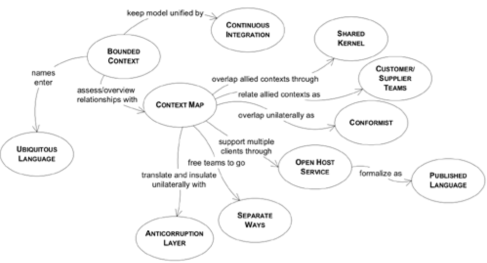
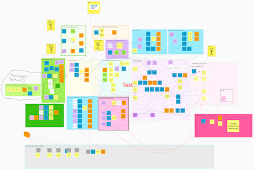

# 领域驱动设计 （Domain Driven Design） ... 持续更新中 
这个题目拖了很久了，一直没有时间把自己的学习和领会写下来，这都2020年了，完成它！本文主要内容来自Eric Evens的《Domain Driven Design》一书，结合了我的一些理解和实践经验，希望对读者有帮助。同时这里你可以下载到我自己准备的用于培训的PPT，既然是PPT那内容肯定很粗略，但可以当个大纲看。  

大多数做微服务开发的同学对DDD这个名词肯定不会陌生，至少是听说过的。当我们面临从传统Monolithic系统转向微服务构架时，第一个问题就是怎么划分出微服务，它们之间如何关联，怎么进行全系统设计？数据一致性如何在微服务之间保持，微服务的“先民”们也不例外要面临这些问题，神奇的是大家忽然发现这些问题在Eric的DDD一书中都有讨论和结论，于是 DDD名声鹊起~现在到了谈微服务必谈DDD的地步（除非你是码农一个，只动手不动脑，按领导要求抱着Spring Cloud全家桶一顿整，那确实，DDD与你无关） 从这个角度来上说，是微服务“成就了”DDD啊。这里我们要明确一下，是DDD成书在先，微服务出现在后，所以在DDD全书中你找不到“微服务”这个名字，虽然到处都是微服务的影子。

DDD一书到底讲述了怎样的理论呢？其实特别简单：**软件设计要以业务领域概念为一个稳定的核心，全员（产品，开发，测试）参与共同建模出本领域模型并不断“重构”它**。书中阐述了衡量良好模型的多个维度，并从这些维度上给出具体技巧（作者喜欢称之为“Pattern”，模式）来指导我们建模。

## 一· 软件项目为什么容易失败  
我印象中10年前（甚至今天）软件项目简直就是“延期”“超预算”的代名词 （但愿这种印象只是我本人的错误感觉，如果开发项目规模相对较大，确实不容易掌控，把谁搬来都不好使）。Eric根据自己的经验给出的原因是：软件开发本来就复杂度很高，更要命的是产品人员和设计人员（Arch），设计人员和开发人员之间都存在信息的丢失和“变形”，不采取点儿“手段”能按时按点儿保质保量地做出来才怪呢！  

### 软件复杂度哪里来  
首先是实施阶段，真正开发的同学（码农？）要确保已经正确理解了业务上要做什么，然后是理解了可能是其他同事完成的设计，最终能不折不扣的反应到代码中去，整个这个链条就涉及很多对接点儿，完全不出岔子不容易。  即使一路顺利功能都完美实现了，那还有我们的实现是不是具有扩展性和“皮实”的特点，这个和下一点相关。  
然后呢是后期的增强和支持，一个软件上线后，后期基本都需要进行再增强的，那经常出现的情况是当初开发被增强功能的那个人已经离开了，到哪里去找原始的设计想法啊！你说“文档”？做过软件工程的都知道那能起多大作用。那么最后的行动方案很可能开发人员自己读一遍代码，根据自己的理解提出个解决方案，Review后实施之~。那么好，到此为止这个功能点已经有2个（波）人的思路在里面了，设想一下这样来几次后，咱的体系结构会是个啥模样。按我的话说就是怎么样才能让我们的架构久经折腾而不变形不走样，那是门学问啊。  
最后呢从使用者的角度来看，我们的产品API（如果有）需要稳定而且易懂，不能说使用我们的接口的产品需要读一遍我们接口对应的代码后，才能完全知道（才能放心）怎么使用它们。要达到这种效果不容易。  

如果我们从这三个维度上看，可以明显的感觉到软件开发本身就具有复杂性，容易变得混乱和失控。

### 信息的丢失  
我们经常在各种培训中做一个“传话”游戏，大家占成一排，过程中不能互相看，教练告诉排头一句话或一个动作，让大家逐个传递下去，音量只能耳语级别，在我的经历中居然没有一次是到最后不走样的。所以说，人和人之间的交流是易错的，最好的方式集体参与，互相验证。Eric也持有类似观点。  
  
他观察到“分析模型”往往和用于最后实施的“技术模型”对不上号，因为“分析模型”主要是产品和几个高阶技术人员完成的，而“技术模型”是开发人员一起根据对分析模型的理解给出的，那会错意肯定不能避免的。

### 怎么办？  
DDD的核心主张是找出那个软件所在领域内的概念，用这些概念构建起足以支撑我们软件的领域模型，这个模型全项目组共享，大家都在一个知识的水平线上。项目组日常交流也要建立在以这组概念为基础的“Ubiquitous Language” （通用语言）上，关于需求的讨论必须要有各个角色的共同参与，特别是要把开发人员纳入进来因为是他们去最终实施。DDD还明确好的设计是易懂的设计！这个原则简直太对了，cannot agree more! 如果说小一点到技术实现级别的话，我们有理由鄙视那些过于追求精炼而让代码难懂或藏雷的设计。在DDD的“柔性设计”部分作者专门讨论了如何在领域模型设计层面让我们的模型易懂。另外DDD主张“化整为零”，把大型系统的开发根据团队结构（例如地理分布），概念的耦合度等原则划分为不同的部分，称为bounded Context, 交给一个个小团队去负责，你看，这个就和微服务想干的事情很一致了。

DDD主张引入“**领域层**”。  分层的思想很早就被用于软件开发，例如烂大街的MVC模式实际上就是把UI，逻辑和DB分开，形成三个层次，上层会去用下层，但下层不会去使唤上层，这是分层的本质。
  
把领域层分出来的目的是单独管理，让这个最为重要的层次稳定健壮，并摆脱上面Application层次需要处理的协调工作和下面Infrastructure层要提供的基础服务，变得精炼。我感觉单独把领域放在一层也是很朴素的想法，技术人员在着手实现领域模型时必然会把它“抽出来”,单独管理。

DDD要求在每个Bounded Context范围内建立Ubiquitous Language （通用语言），在20年前提出这样的概念真的很了不起。建立通用语言的目的拉平产品，开发等项目参与人员的知识水平，从而减少交流中的误解，提高交流效率。做项目过程中交流成本真的很大，处理不好那就是拖延的根源，特别是旷日持久的产品类开发，人员在经年累月的开发和增强工作中会逐步更换，如果来一个新人就让他从0知识开始慢慢成长到全组水平的话，拿着活儿没法保证质量和速度了，还不够给新人填坑呢。

## 二·领域模型建模元素
既然DDD围绕领域模型展开，我们一起来看看模型中都包含哪些基本元素。这里不得不唠叨一下，我特别佩服老外这种总结和拔高儿的能力，很多我们脑子里有但很难描述清楚的东西人家可以三言两语说的清清楚楚而且高大上，这种抽象思考能力是我辈非常欠缺的。  
* Entity（实体）  
代表一个有ID的概念，概念上会有“状态”通俗讲就是属性信息。它的每个实例都会有身份标识，在我们的应用中需要区分对待不同实例。感觉有点儿像面向对象里面的类吧。
* Value Object （值对象）  
代表一个无ID的概念，其上也会有“状态”，但它的显著特点是VO的实例一旦初始化完成，其内部状态后续都是不会更改的，这是它和Entity最大的区别。举个例子吧，系统中订单的Status（Initial，In Process， Closed）可以是一个VO，这个VO可能的实例有三个: Initial, In Process, Closed，这三个Status实例可以被整个系统中的订单来共享，也就是说，不必每个订单都声明状态实例，直接复用这三个里面的一个就ok了。  
* Service （服务）  
这个就好理解了，它上面承载操作，并且呢它内部不包含状态信息。  
* Aggregate （聚集）  
作者并没有把Aggregate作为DDD领域模型元素来介绍，但我感觉它完全可以作为一个基本元素。它代表了一组紧密相关的Entity，每个Aggregate里面有且仅有一个‘Root’ Entity。 Aggregate有个特性，它自己要负责自己内部的一致性，我们外部不需要关心，外部在和Aggregate打交道时一定是通过Root Entity进行的，无法直接接触非Root Entity。所以它带给我们模型的好处是，把一组Entity形成一个自治有机体，简化了模型。  

这里需要指出的是，一个概念到底是那种类型 - 是Entity还是VO还是其它什么 - 和你的建模思路紧密相关，没有唯一正确答案一说，你只要在Bounded Context内始终保持统一理解，不要朝三暮四就ok了。

现在有了这些元素，你就可以开始你的建模之旅了。想一想你的软件领域内哪些可以做为Entity，哪些更合适做为VO，等等，以一种整个项目组都能理解的表示方式表述出来，那么你的模型就形成了。当然现实肯定没有我说的这么easy :-)，能熟练完成这个过程前需要大量学习和实践，这个就靠个人的努力了。DDD不强调用什么方式去表述模型，最最朴素的框框图可以，严谨的UML图也挺好，纯粹文字描述也不是不能接受，全看项目组的喜好。

## 三·管理模型元素生命周期  
DDD首先探讨了如何管理模型元素的声明周期，主要是怎么创建创建出实例来，接下来如何管理这些实例，保证一致性，遍历实例等等。  
### 实例的创建 - Factory模式  
Eric把自己建模过程中的一些技巧，窍门统统叫做“Pattern”，模式，也鼓励借鉴技术领域的设计模式（那23中经典设计模式）的思想用于构建领域模型，这往往让读者困惑，我们要始终记得我们在讨论领域模型的事情，即使某些模式名字“恰巧”和设计模式一致，我们也只是用它的思想，而不是要建立出设计模式里该模式应有的类（角色）。  

DDD特别担心建模者的注意力分散，例如需要处理复杂概念的实例创建，或者处理Aggregate的创建，那么一下子大家的思路就分散到技术细节上去了，有没有办法把这些复杂性屏蔽掉呢？马上想到了设计模式中的‘Factory’模式，它的思想可以借鉴过来嘛：**我们为复杂概念配备Factory，它专门负责构建实例，每当我们需要该概念实例的时候直接去找这个Factory要。** 经过这么一包，领域模型层面就清爽了，当然这个Factory有可能有许多繁琐的技术细节，那对不起，咱领域模型层面不操这心，留给技术实现吧。  
  
DDD建议我们的Factory要保持两个原则：  
* 创建的原子性：一次给足Factory需要的构建参数，一次完成创建。我感觉作者是强调不要采用Builder模式的思想，一点点逐步构建，因为那样的话需要调用者去理解创建的逻辑，违背了封装复杂性的目的；  
* Factory要独立存在：不要让概念本身承担Factory的职责，因为DDD提倡概念清晰化，职责单一话，你把复杂的实例创建逻辑都放在那个概念上不是让它很繁琐嘛？
### 实例的遍历 - Repository模式  
对于那些被全局访问和使用的Entity，我们要为它们每人都配备一个Repository，使用过JPA的同学可以用JPA里面的Repository类比一下。这里说的“全局访问”是相对于Aggregate里面非Root Entity的其它Entity说的，那些Entity根本不会在Aggregate之外直接访问，所以没有必要配备Repository。  
对于普通Entity，Repository会负责创建，返回，删除Entity实例；而对于Aggregate，Root Entity的Repository负责了整个Aggregate，因为外部不会和非Root Entity的其它Entity直接打交道嘛。  

## 四·隐式概念显示化  
前文提过，DDD特别在意模型的清晰易懂，发现领域中很多“潜规则”并把它们明显地大声地表述出来是很重要的，只有把隐藏的概念，逻辑都显示化地表述在模型里，才能得到我们向往的“深层模型” - 指一种全面，清晰的领域模型。为了达到这种境界，我们需要敏感地注意发现那些隐藏的概念，例如通过：
* 倾听领域专家讨论时使用的语言。看是否有新词出现，这词没有在我们的Ubiquitous Language中；或者专家纠正了我们的一些用词；在讨论进行过程中有没有力不从心，词不达意？
* 不断检查现有模型，发现不足。思索当前设计的蹩脚之处
* 多读书，借鉴其他人的模型  

### 技巧 - 把过程建模进模型  
所谓“过程 Process”，是指一系列操作和处理的过程，在我们的软件中，总是会有些特别重要和处理过程的，它们太重要了，我们需要把它们明显的放置在模型中，回顾我们手里的模型元素会发现，Service非常适合承载过程，那我们就可以使用它。  
另外，我们也经常遇到过程本身有多种替代方案的情况，条条大路通罗马，做一件事本来就很少只能用一种方式，那么建模这样的模型时该怎么处理？我们可以参考设计模式里面的“Strategy”模式的思想，把各个方案都做成“Strategy”。  

注意不要乱，这里的重点是，那些重要的过程我们最好把它们单独建模在模型里，不要把它们隐藏在相关的Entity中。

### 技巧 - 把约束建模进模型  
所谓“约束 Constrain”，是指我们模型元素需要满足的各种规定，这些规定往往是领域所要求的，这个也很好理解，各行各业都有自己的要求嘛。从某种意义上来说，正是这样的约束，刻画出了我们的领域，所以我们要尽量把重要的约束建模进模型中。其实即使不显示地放在模型中，这些约束也不可能被我们在实施过程中丢掉，最简陋的做法是把这些约束重复地放在相关的Entity上，问题是重复本身就是一种很傻很浪费的行为，但如果只放在一个Entity上呢那就更严重了，这个Constrain污染了我们的Entity：破坏了该Entity的概念完整性。那么怎么为约束建模更好呢？  

DDD在这里隆重推出了它很得意的**“Specification”模式**，号称是Eric和另一个牛人一起创建的。一个Specification是一个Value Object，它里面有一个个的谓词操作，所谓谓词操作就是返回对或错的操作，每个谓词操作都代表了对一种约束或规则的检验，检验结果自然是有过和不过两种。通过这种方式我们把重要的约束和业务规则都清楚地放在了模型中。

Specification有一个很有意思的特性，它的谓词可以通过逻辑操作符进行组合，例如 True AND False = False，如果我们所设定的谓词足够小，那么我们的代码可以方便的按照业务逻辑的变化而调整。

## 五·柔性设计 （Supple Design）  
软件的目的当然是服务于最终使用者，但软件自身的开发，增强和维护都离不开开发者，开发者是一个软件的隐形消费者。软件的设计的优劣，不完全决定于是否完成了既定的功能以及多么出色地完成了这些功能，还在于它后期的演化能力，历经演化而不死的健壮性，这需要软件的初始设计充分考虑后续开发者。易于理解，（内部接口）易于使用，易于增强是衡量优秀设计的重要标准。  

在这一大部分，DDD主要探讨怎么让领域模型容易理解。  

### 技巧 - 力争创造“自解释的接口” （Intention Revealing Interface）  
封装是面向对象编程的基本特征之一，封装的核心意义是什么？对我来说不可忽视的一点是对使用者思想的减负。作为一个使用你制造出来的某些东西的人，我所关心的只是1）它能做什么；2）怎么用，为了达到这两个目的而作的任何多余的操作对我来说都是负担。对于我们的模型概念，类和方法，我们的同事，合作伙伴和客户都可能是其潜在“使用者”，我们要力求让它们的名字让人通过它可以猜测到其功能和使用方法，而不用去读文档，甚至读实现。无可否认，要达到这样的效果需要很高的技巧，我们需要把握一个合理的度，但与此同时我们也要提醒自己，如果我们的同伴，或客户只有在读过其实现（例如代码）后才能去使用它，这是我们作为创建者的失败。

如何更好的命名呢？DDD的建议是：  
* 命名时面向“效果和目的”，不要试图夹杂进“怎么去实现”的信息。如果我们讨论“类和类的方法”的命名，
* DDD还给出了一个挺有创意的思路：认真写UT，并且写时从你的方法使用者角度去思考，这样你可能发现更好的命名方式。

### 技巧 - 力争创造“无副作用操作” （Side Effect Free Function）  
这里所说的“副作用”指那些影响来将来会执行的操作的“系统状态改变”，我来举个例子，快过年了，不法分子A一合计，咦，今年过年钱还没凑出来，干脆偷俩井盖儿卖了换钱吧，于是就干了。这就是一个产生了副作用的操作，因为后来路人甲黑灯瞎火地骑车过来掉井里了。他为什么掉井里了呢？因为**不知道**这里的井盖没了。对，带副作用的操作给其它操作带来的危害是：”**不知道你对我将要用到的资源都产生了什么影响**，我还傻乎乎地执行呢，不知不觉就掉你挖的坑里了“。

DDD给我们地建议是：
* 思考一下我们需要地操作，把它们分为两类：一类称为”查询“，它们只对信息进行查询；一类成为”命令“，它们会对信息进行修改  
* 对于”查询“，确保其不改变数据；对于”命令“，确保其短小，确保每个”命令“都专注，如果配以自解释地接口，使用者一眼就可以知道用了它我们将得到啥  
* 于此同时，我们要不断观察这些查询和命令，寻找它们能挂靠的Value Object，甚至为它们撞门创立VO。这里有心的读者可能会问”咦，VO可是一经创建就不改变的东西，命令可是要改东西的，怎么肯能把命令放到VO里呢？“， 好问题，但很好回答：VO是不会改自己的内部状态，但它完全可以去操作和改变不是自己的信息。

我的感想是，其实使用”无副作用操作“的根本还是思想减负，每个操作，无论是查询还是命令，都变得意义清晰，简洁明快；其次，无副作用的操作是操作组合的基础，这很重要。作为使用者，我的工作可能是基于手里的材料（各种API，操作）造出我需要的新操作，只有我不担心我所使用的材料出幺蛾子我才能放心的做我的编织工作，同时只有我的材料足够小粒度，我才能有更大的灵活性。这些都是Side Effect Free Function所能提供的

### 其它柔性设计技巧
技巧DDD还介绍了很多，感兴趣的同学还是去看原书了解吧，我这里只写个概要
* 用断言 Assertion： 我们在Function的结尾用断言去检验既定目标的达成；或是利用专门的UT做这方面的检验
* 寻找“概念轮廓” Conceptual Contour：我们努力地开展建模工作，是基于一种信念：我们所从事的领域是有其客观模型存在地，对吧？那么当我们发现不合理之处，我们要深入思考模型本身哪里没有贴近事实，从而不多靠近那个理论上地完美模型
* 使用“Standalong Class”：如果有可能，让我们地某些概念，类彻底和其它概念和类隔离，这样相对其它概念它不会造成什么大地危害，毕竟大家没有什么联系嘛。
* 使用闭环操作 Closure of Operation：所谓闭环操作是指那些操作数和操作结果都是同种类型的操作，举个例子，加减乘除在实数范围内就都是闭环操作。它们的好处是什么呢？因为这种操作所影响的范围就只有这一个概念，操作的过程也不会过于难以理解。实话说这方面我的体会少一点儿，还需要时间去经历更多吧。

## 六· 将设计模式应用与领域模型建模  
我们所熟知的那23种”设计模式“侧重在解决具体的技术问题，而领域模型关注领域复杂性，用于清晰化一个领域，二者发力的层次不太一样。粗浅的说，领域模型更宏观一点儿，而设计模式更细节。但如果我们能把设计模式的思想充分领会，那它们的想法是完全可以被应用到领域建模上。

我们在之前的章节中已经看到很多在设计模式中耳熟能详的名字，这章里Eric用组合模式（Composite）和策略模式（Strategy）作为例子来说明自己的想法。

### 组合模式  
组合模式在设计模式中并不是很复杂，你可以用操作系统中的文件夹，文件等之间的关系或者用数据结构里面的树（根结点，叶子结点和非叶子结点）来思考，就永远不会忘记这个模式的本质了。组合模式里面的两个角色特别重要，一个是‘Leaf’型Component，一个是“Composite”型Component，前者不会再包含其它的Component，而后者可以包含其它的Component，无论是Leaf还是Composite。

组合模式体现了一种类的自包含性，（其实我感觉这样说有点儿不对劲儿，等我想出更好的表达方式再说吧），也就是说一个类有以这个类为类型的属性。这就使得它特别适合表达层级关系。我们知道在领域概念层面我们也会讨论一个实体（Entity）和它的属性，那么自然可以借用组合模式的思想来表达层级关系。

### 策略模式
在设计模式中策略模式就更简单了，（它是我认为你想忘记都很不容易的几个模式之一，因为太简单了），它解决的问题是“做同一件事情我们有N种手段，运行时具体用哪一种手段需要运行时决定”。例如我们的程序会根据用户的操作来决定我们的策略，我们哪里知道他会做什么操作呀，自然在设计时无法hard code所用策略。

那么在领域概念层面这样的情况也会出现，所以这个模式的思想就可以拿来用，在前面章节中就有用过。

### 是不是所有23中模式都能用于领域建模？  
这个可不是，DDD举的例子是“Flyweight”模式，也就是享元模式，这种模式是我们设计各种“池”必用的模式，例如数据库连接池。核心思想是把一些类的实例做成一个池子，所有要使用它们的人都只有这几个实例可用，共享的。它能达到的目的很多，核心还是资源的共享。

享元模式就不适合领域建模，因为它存粹的侧重在实例这个层面，在概念层面很难找到它的用武之地啊。

## 七·领域模型也需要持续地重构  
重构在现代软件工程里随处可见，不仅仅限于代码级别，我觉得这是敏捷这股思潮推动的必然结果，在敏捷的大背景下，一切都可快速迭代而演化，需求如此，代码如此，位于需求和代码之间的领域模型自然也是如此。我们需要意识到这一点，经常回顾我们的模型，平时留心模型需要进化的信号，从而保持它的有效性。DDD给我们一些模型需要改进的信号：首先是我们发现新的需求没办法顺畅加入当前软件；其次Ubiquitorus Language不能满足项目组的讨论，有些意思表达不出来了；再有专家们讨论时有新名词出现。这些都提示我们当前领域模型可能有必要演化了。

当我们决定升级领域模型时，该如何有效开展这项工作呢？DDD也给出自己的看法：  
* 组建一个小的探索团队，这个团队各种角色人员最好都有，特别是开发角色不能漏，领域专家也要参与，大家一起开个头脑风暴，快速形成建议  
* 也需要借鉴前人经验，从书本上获得一些灵感，例如《分析模式》这本书
* 必须要考虑开发人员的理解与否，他们不走样地执行是成功的基础

危机就是机遇，不要害怕模型失效，每一次这种情况发生，都是我们更靠近真实模型的机会。  

## 八·Bounded Context  
在上面的各个章节，DDD讨论了领域模型的构建和维护，接下来的的各个部分将会着眼更宏观的层面，讨论战略设计层面的问题。如何组织大型软件 - 多个团队协同开发 - 的设计和开发。这之所以是个问题，就是因为一个字 “大”！这一部分的讨论被分成三部分：限界上下文（Bounded Context），精炼，大型构建。首先是知名的“Bounded Context”。

限界上下文解决的问题是大型软件开发过程中如何自始至终保持模型的完整性和一致性。作者开篇具了一个很常见的一个例子。

两个团队都工作在一个大型财务软件的开发部门，他们负责不同部分但最后会合并构建出最终系统。这两个团队在各自的开发中都需要一个“付费”的概念，各自设立了与之对应的模型实体。当系统上线后，其中一个团队发现，数据库中会“莫名其妙”的出现一些付费数据，并且每当生成税务报表时系统就挂掉（经查也是这些数据的不完整性造成）。最后通过这些问题的“牵线搭桥”，两个团队发现各自都在维护同一个概念实体，但显然对该实体的应有特性没有统一认识。这是一个典型的团队之间针对各自所负责的领域上下文划分不清造成不良后果的示例。

当软件比较大，需要多个团队，甚至跨地域团队，一起完成时，交流成本急剧上升，保持信息的及时共享是几乎不可能的，Eric给出的解决方法是就不要强求各个团队工作在同一个“context”下面了，制定好大家的边界，然后各行其是，各自只要保证在各自的Context内的一致性就ok了。这种处理方式需要各个context制订好边界：各自context都有哪些概念，相同概念在不同context下的名字是什么，它们如何对应，两个context之间相互关系是什么，如何互动，等等。其实划分开来并没有让所有问题消失，这些随之出现的问题同样不好回答，但好处是处理好这些问题的话各个团队就可以在相对自由的环境里随意发挥了，这特别契合微服务的理念。

上图给出了在Bounded Context部分的重要模式。我们逐一简介。

### Bounded Context  
根据组织机构中的团队划分情况+软件系统的各个部分用法以及功能来划出一道道“边界”，从而形成多个即相互关联又彼此独立的“单元”。我们把这样的“单元”叫做“Bounded Context”。每个BC都应该有名称，并且放入Ubiquitous Language。  
* 一个Bounded Context内部要求模型的“一致”。也就是说概念上完备，逻辑上统一，故事讲的通；而各个BC之间没有这种一致性要求，这就是自由的根源。
* 一个Bounded Context不仅仅包含自己的领域模型，还有需要的数据库以及需要编写的应用程序。
* 每个Bounded Context可以有自己的Ubiquitous Language。
* 一个BC只被一个团队负责，一个团队最好也只负责一个BC，但必要时可以负责多个BC。

如上所述，这带来的好处是在BC内的自由。“坏处”：会需要BC之间的集成，但这个未必是真的坏，因为事实上大型系统开发各个团队工作在一个大而全的BC之下是得不偿失的，无论如何都有必要做这种划分

**Bounded Context 内部用Continuous Integration来保持一致性**  
一个BC内我们需要保持一致性（模型的一致性，功能的一致性），这并不会因为一个BC“小”而自然获得，这个我们做过开发的都知道，团队成员之间需要频繁的“对表”，各种敏捷的手段就是为了解决这个问题。为了保持BC内一致，我们可以：  
* 用极限编程或者叫结对编程。Scrum Daily meeting也为我们提供了频繁交流机制    
* 建立一个把所有代码和其它实现工件频繁地合并到一起的过程，并通过自动化测试来快速查明模型的分裂问题  
* 利用自动化测试做回归测试  
* 维护并使用Ubiquitous Language  

### Context Map
现在一个大型系统被分成了许多自治的BC，它们之间会出现重复概念，怎么办呢？需要建立‘Context Map’。CM的作用是通过指出BC之间的共享概念；指出BC的联络点，BC之间通信时需要做的信息转换。  

描述CM不需要高大上的工具，只要能说清楚，手画图形，文档，无论什么都可以。下面这张图是我们项目利用一个在线工具只做的BC和CM。  

CM指出了共享概念，那么实际实施时如何共享这些概念呢？通过代码共享吗？那可不一定。实际上这是一个BC之间相互关系的管理问题，那就是接下来要讨论的了，我们一起来看看BC之间的关联技巧。

### BC之间的关联  
在一个软件结构中的各个Bounded Context十有八九是会有联系的，毕竟大家要一起协作完成一个业务流程，那么这些BC之间是何种关系呢？换句话说，我们在设计阶段该怎么规划它们的相互关系，从而使得最终集成不出问题呢？这里Eric列举了他总结的集中模式。

**BC之间关联模式一：Customer/Supplier Dev Team模式**  
如果两个BC（往往对应了两个开发团队）之间的依赖是单向的，上游BC为下游BC服务，下游是上游的客户，并且上游很在意下游的要求，那么可以把这两个团队用客户/供应商的模式组织起来。双方设立共同参与计划会议，下游客户让上游供应商了解自身需求，时间节点，而上游供应商能够充分考虑这些信息来组织开发。

有心的同学可能有问题了，上下游的关系必须很“铁”才能行啊，不然这种模式肯定玩儿不转。没错，要保证这种模式成功，需要有些条件保证：
* 下游客户的需求要被上游供应商充分尊重。如果一个上游有很多的下游，那么可能会需要选择听谁的而不听谁的，那么被牺牲的下游就很被动了。  
* 必须有自动测试。用来保证上游供应商的修改不会影响到下游客户。这些测试用例最好是双方共同制定从而具有一定约束力。  

**BC之间关联模式二：追随者（Conformist）模式**  
Customer/Supplier Dev Team模式要求下游对上游有绝对的影响力，否则肯定不行，如果很下游就是对上游没有足够的影响力怎么办呢？那一种选择是下游老老实实做一个跟随者。具体来说就是上游怎么订游戏规则我们下游就怎么用，他们变了下游无条件跟着变就ok了，不爽了抱怨两句，然后该干嘛干嘛。在这种模式下，下游BC甚至可以直接复用上游BC的Ubiquitous Language。  

猛一看好像在这种模式下的下游很没面子，其实也是有好处的：一会儿我们会讨论BC之间的集成，不同的BC关系模型集成的难度和风险肯定是不一样的，而在跟随者模式下二者集成基本没有风险。

**BC之间关联模式三：隔离层（Anticorruption Layer）模式**  
两个BC有共同概念，也可能会有通信的必要，那么我们由其中一方建设一个隔离层，这个层内实现BC之间概念的转换，也可以包装对另一BC所提供服务的调用，达到简化服务访问的目的。有了这个隔离层，所有集成的风险都被放入了这一层，就像是一个防腐隔离层。  

设计模式里的Façade和Adapter模式的思想都可以很好的被应用到AL的设计：  
* Façade (对方动)：在另一方的BC内设立一个门面，专门为我方BC服务
* Adapter (我方动)：我方把另一方的概念包装一下，形成我方概念从而在我方BC内使用

**BC之间关联模式四：Separate Way模式**  
就是说大家各干各的，完全避免产生关联，也就避免了后续集成，也避免掉集成带来的沉重负担。决定采用这种模式需要比较大的勇气，谁也没法预测未来没有关联的必要性嘛，如果不行后续这两个BC被用到某个共同的context下或是最后发现需要它们交互和协同，那么就需要设立中间层进行转换，代价不小。  

这种模式对于那些非常独立的模块很实用，可以大大提高效率。代价是一旦采取这种模式进行，后续再想换为其它模式很难，代价高。

**BC之间关联模式五：Open Host Service模式**  
上面介绍的几种关联模式需要我们在设计时就知道有哪几个BC之间产生关联，会不会有在设计时我们根本就没法预测后续会有哪些BC会和已知BC会产生关联呢？肯定会有，例如，预测客户会要求我们做后续扩展工作，那么我们现在做设计时就要留足余地。再有，我们的一个BC要被许多的BC关联，那么上面的那些模式带来的复杂性都不小，例如AL模式，那要建立多少隔离层呢？  

Open Host Service模式的想法是让那些有可能被关联的BC制定服务协议（接口），那么所有需要使用我服务的其它BC只要按照这组规约行事就没问题。  

**BC之间关联模式六：Publish Language模式**  
我们在Open Host Service模式上再进一步。OHS要求服务的提供者是确定的，我们设计时就知道就是这个BC会提供其它BC需要的服务，只是不知道其它BC是谁；那如果我们连服务提供者都不知道呢？或者说我们允许第三方开发把自己开发的服务集成进我们的系统来提供服务，该怎么处理？  

这个时候PUblish Language的思想就派上用场了。我们定义一组服务提供者和消费者之间的交流语言，消费者以这种语言为基础表述自己的需求，而服务者可以根据语言定义理解需求，从而提供相应服务。那么问题就解决了。

我们在做微服务就会经常使用这种思想。