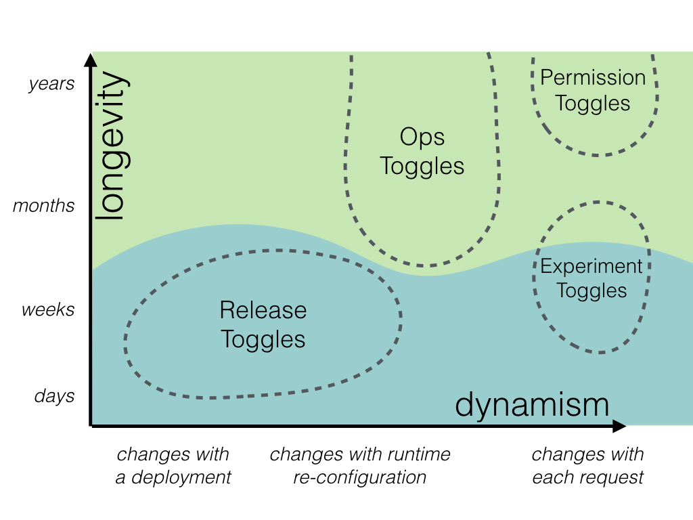

# 功能触发器 - Feature Toggles

项目需要我们引入功能触发器，来控制一个新功能的开与关。团队成员有了不少讨论，对Feature Toogle的认识大相径庭，所以我想第一步还是要对它追本溯源，看一看这个东西原始用意是什么；第二步再结合自己项目的情况，来确定我们接下来的开发中如何使用它。于是翻来Martin Fowler在其个人网站上援引的[针对Feature Toggles文章](https://martinfowler.com/articles/feature-toggles.html)一探究竟，下面的内容除非注明，均是作者Pete Hodgson的原意，不包含我的评价和理解，当然由于我没有word by word的进行翻译，也可能会由于英文理解造成错误，所以强烈建议有能力的读者去读[原文](https://martinfowler.com/articles/feature-toggles.html)。

这篇文章主要是谈Feature Toggle的思想，我在[另外一篇](ApplyFeatureToggle.md)中会总结现实应用Feature Toggle时面临的问题和应对手段。

> Feature Toggles 是一种强大的手段，它允许我们在不更改代码的情况下改变系统行为。Feature Toggles有多种不同类型，我们有必要分清这些类型。同时Feature Toggles会引入额外的复杂性，我们有必要用聪明的手段去实现toggle管理toggle，即便是这样，尽量减少Toggle的数量也是我们必须重视的问题。

## 从一个例子看Toggle  
场景是我们有一个在开发的大项目“town planning simulation game” - 模拟小镇规划游戏，我们的团队负责一个部分。一天，我们接到一个任务：优化一下已经存在的“Spline Reticulation”算法。我们发现这并不是一件简单的事情，需要较多开发工作所以需要时间，与此同时，其它的团队还在工作，它们依赖于SR算法所以它要“在线”，我们的开发不能影响它们的工作。另外我们这个小组依照单分支的原则工作，我们不会有时间跨度很长的分支或者说我们所有人都在主分支（master branch，trunk）上工作。在这些要求和客观条件下我们该怎么开展工作呢？ 看来引入一个Feature Toggle是很好的选择。  

### 引入Toggle  
假设开始时SR算法长这个样子 (JS代码）  
```javascript  
  function reticulateSplines(){
   	// current implementation lives here
  }
```

我们来做一个最简单最直观的Toggle:  
```javascript  
  function reticulateSplines(){
    var useNewAlgorithm = false;
    // useNewAlgorithm = true; // UNCOMMENT IF YOU ARE WORKING ON THE NEW SR ALGORITHM
  
    if( useNewAlgorithm ){
      return enhancedSplineReticulation();
    }else{
      return oldFashionedSplineReticulation();
    }
  }
  
  function oldFashionedSplineReticulation(){
    // current implementation lives here
  }
  
  function enhancedSplineReticulation(){
    // TODO: implement better SR algorithm
  }
```

当我们需要打开新功能时，我们就把第一行代码注释掉，同时把第二行的注释去掉，那么新功能就启用了。一个最简单的toggle就诞生了。

### 动态化该Toggle  
上面的toggle显然是粗糙的，很快我们的自动化测试人员开始抱怨起来，显然我们既要测试老SR算法（Jacky：因为生产环境还在用）也要测试新SR算法（Jacky：因为将来它们需要正确工作），在上面的toggle的基础上，在不改变代码的条件下，不可能测到两种算法。很快，我们写出下面的代码：  
```javascript
  function reticulateSplines(){
	if( featureIsEnabled("use-new-SR-algorithm") ){
	  return enhancedSplineReticulation();
	}else{
	  return oldFashionedSplineReticulation();
	}
  }
  function createToggleRouter(featureConfig){
    return {
      setFeature(featureName,isEnabled){
        featureConfig[featureName] = isEnabled;
      },
      featureIsEnabled(featureName){
        return featureConfig[featureName];
      }
    };
  }
```  
上面这段代码引入了一个“配置” - use-new-SR-algorithm, 它的值可能是通过其它手段由外部指定的。同时这里我们引入了一个“Toggle Router”，它的作用是获取或计算进而传递配置。有了上面这中新的toggle，我们的自动化测试脚本可以这么写,新老算法都会被测到：  
```javascript
describe( 'spline reticulation', function(){
  let toggleRouter;
  let simulationEngine;

  beforeEach(function(){
    toggleRouter = createToggleRouter();
    simulationEngine = createSimulationEngine({toggleRouter:toggleRouter});
  });

  it('works correctly with old algorithm', function(){
    // Given
    toggleRouter.setFeature("use-new-SR-algorithm",false);

    // When
    const result = simulationEngine.doSomethingWhichInvolvesSplineReticulation();

    // Then
    verifySplineReticulation(result);
  });

  it('works correctly with new algorithm', function(){
    // Given
    toggleRouter.setFeature("use-new-SR-algorithm",true);

    // When
    const result = simulationEngine.doSomethingWhichInvolvesSplineReticulation();

    // Then
    verifySplineReticulation(result);
  });
});
```
Jacky注：Toggle Router是一个重要概念，它会为系统的其它部分提供toggle的当前值，相当于一个single source of truth。那么它需要在合适的时候去获取这些toggle的值。由于系统内它是唯一的toggle提供者，这也为我们集中控制toggle提供了便利，例如根据环境背景（如那个用户）去决定一个toggle值，这就是可能了。  在上面的例子里面光看代码可能很难看出Toggle Router是怎么在系统里工作的，我想可能是需要很高的JS知识才能猜测出来。

### 准备发布  
随着时间的推移，我们的开发渐渐完成，我们不再简单满足于自动化测试用例都通过，我们已经准备好在线上去实验新算法的功效了。那么第一个问题就是我们以什么形式来改变feature toggle的值呢？我们可以在三个层次上组织toggle的修改：  
- Toggle的值被写进一个配置文件，不同的环境有不同的配置文件，在向这个环境部署代码的时候也会把对应的配置文件部署上去。而我们的Toggle Router会去读当前的配置文件，从而得到当前环境的toggle值。我们会在测试环境的配置文件中打开新SR算法的toggle，而在生产环境关闭。  
- 引入一个配置UI，管理员可以通过这个UI改变当前application的toggle值。一旦新SR算法被管理员打开，整个系统的用户都会用到它。    
- 我们改变Toggle Router的代码，让它更强大一点儿，能够分析当前user request以及当前环境(context)，从而决定一个toggle的值。例如通过检测http header，检测cookie项等等。这最为灵活。

下面这张图描述了这三种不同方式：  


经过讨论，我们项目组选择了第三种，基于user request的toggle。大家觉得这既保护了在线的老版本正常服务，也为我们项目组提供了在生产环境测试的可能。

### Canary Release  
新SR算法发布了，经过Exploratory testing，一切正常。但team觉得这么重要的功能还是谨慎一点好，所以可以利用我们的Toggle机制做一次Canary Release。（Jacky注：不是所有类型的toggle都能支持canary release）  

为了做Canary Release我们要把Toggle Router增强一下，让它”随机“抽取一小部分进来的用户请求启用新SR算法（Jacky注：作者在文章中指出Canary Release突出的是随机），我们注意收集这部分用户在使用新算法时的效果，这个过程一直持续到team对新算法有了完全的信心。

### A/B Testing  
游戏的产品经理听说了这件事情，她很兴奋，因为类似的机制可以解决她的一个棘手问题：产品团队一直在围绕是否提高游戏中犯罪率争论不休，有了这种机制不是正好可以收集一些数据让数据说话。但和canary release不同的是，可能我们需要观察固定用户群的行为从而做决定。这就是A/B Testing。

这个小例子就完了。接下来我们围绕不同类别的FT深入探讨，看看它们为何不同。

## Toggle的分类  
Feature Toggles提供的根本能力是：能够在单一部署中ship不同的可以互相替换的代码路径（codepaths）。上面的例子很好的展示了这一点。同时FT的类型有多种，用同种方式管理它们会很痛苦。

我们从两个维度划分FT：
- 维度一：Toggle会存在的长久性
- 维度二：Toggle的切换灵活性（how ***dynamic*** the toggling decision must be)，作者后面把这个维度分为三个层次：1) changes with a deployment, 2) changes with runtime re-configuration, 3) changes with each request

我们先看看几类toggle，然后从这两个维度观察它们。下图展示了我们将要看到的这几类feature toggles。


### Release Toggles
> Release Toggles allow incomplete and un-tested codepaths to be shipped to production as latent code which may never be turned on

这类Toggle使得使用单分支开发的项目组能够实践持续交付（Continuous Delivery）。也就是说团队工作的半成品也可以被merge到主分支，之后打包发布到线上而不影响生产环境用户。这些半成本做为“潜伏代码（latent code）存在，它们可能在以后的某个时间点被激活，也可能将来被直接废弃。

很多产品经理会使用“产品版本（product-centric version）”来防止未成熟的功能暴露给她的用户，其实这里的产品版本和Release Toggles手法是类似的。例如一个网上商店开发了一个功能可以为用户预测货物送达时间，功能已经开发和测试完成了，但是由于某些原因目前只有出自某一个供应商的商品的预测送达可靠，其它供应商的话这个功能由于缺数据而没有意义，那么产品经理可能决定等全部供应商都具备支持送达时间预测的能力时才向用户开发这个功能，在此之前，这个功能不会包含在她的产品版本中。产品经理有各种原因考虑推迟功能的发布，例如配合市场推广活动。***如此使用Release Toggles是我们实践CD一大原则”解偶功能发布和代码开发“的最普遍的方式。***

从存在时间角度来说，Release Toggle存在时间一半比较固定，或者说短，因为产品的发布周期是相对固定的；从toggle切换灵活性角度来看，Release Toggle要求不高，在该版本运行过程中不太会切换toggle，和新产品版本一起配套发布一个toggle 配置文件就足以了。

### Experiment Toggles  
它被用来进行多变量测试（multivariate）或者说A/B测试。做法是把我们的用户分个类，然后呢给不同类的用户使用不同的codepath，最后观察各个用户群的效果或反馈，最后得出最优解法。这种方法往往被用于那些需要基于客观数据而进行改进的场景。

Experiment Toggle估计不会存在很长实践，实验总归是个短时的行为，不太可能持续很久；它对toggle判断结果的灵活性要求是最高的：每个request进来都要根据该request的背景信息决定，“changes with a deployment" 或“changes with runtime re-configuration”。

### Ops Toggles  
运维过程中，它们被用来控制系统的行为。当我们对某个新功能带来的影响没谱儿，我们会考虑引入这样一个toggle，在必要时切换它到旧版本或关闭。

很多Ops Toggle都是短命的，当我们对功能有信心了我们就拿掉它。但我们都知道系统里很普遍地长期存在着某些”杀手级开关“以备不测，所以说很难说这类开关存在实践短。从toggle切换的灵活程度来说，一半是有个管理界面，所以说达到运行时能配置这个级别就足够了。

### Permissioning Toggles    
> turning on new features for a set of internal users \[is a\] Champagne Brunch - an early opportunity to drink your own champagne。（Jacky注：Champagne Brunch的直译是香槟酒早午餐，和Branch是两回事）

它被用来改变特定用户群的可使用功能。例如白金用户可以但普通用户不能，或者一些新功能只开放给内部用户。这里作者用“Champagne Brunch”来指代能为特定用户打开新feature的技术手段（I refer to this technique of turning on new features for a set of internal or beta users as a Champagne Brunch - an early opportunity to "drink your own champagne".）

看起来“Champagne Brunch“和”Canary Release“很类似，它们的不同点是，Canary Release是随机选取用户而Champagne Brunch是特定用户或用户群。

考虑白金会员的例子的情形，这类Toggle存在的时间跨度可能很长（Jacky注：我们甚至可以把它看成功能的一部分）；而toggle切换的灵活性肯定是per request的。

## 管理不同类别的Toggles  
上面我们给出了toggle的两个维度：长久性和动态性，也给出了不同Toggle类别以及它们在长久性和动态性上的要求，下面我们讨论如何管理它们。

### 静态 VS 动态 toggle （static vs dynamic toggles）  
如果Toggle需要根据运行时的信息来决定结果，往往需要针对Toogle Router做更多的实现工作（Jacky注：router代码复杂呗），同时配置这些router也相对复杂。例如上面提到的Experiment Toggle，它针对某些用户开放最新功能来收集对比数据，那么router需要实现我们制订好的用户分群信息从而作出决定。  
而静态的toggle比较简单，配置项上已经写死了“on”和“off”，router只要读出来，然后直接把这个信息返回给请求放（Toggle Point）就完事儿了。  
这里提到了Toggle的配置，后续会做更深入的讨论。  


### 长期存在 VS 短时 toggles
对于短时存在的toggle，我们甚至只要用if/else临时对付一下就可以了，因为我们知道在不久的将来它们就会被清理；而对于将会长期存在的toggle则不然，我们需要在软件设计时好好设计，保证它们的可维护性。  


## 实现Toggle的技术手段  
其实Feature Toggle机制特别容易毁坏Toggle Point所在处的代码设计。特别是对于那些长期存在的toggle，我们要留意该feature toggle是怎么设计的，Toggle Point是怎么使用它的。  

### 解偶决定点和决定逻辑 （De-coupling decision points from decision logic）  
一个常见的问题是把toggle结果的计算逻辑混在使用toggle的地点，也就是把toggle router的内容直接写在toggle point内。

假设我们做了一个新功能，可以让用户在发货通知email中通过点击一个链接来取消订单，我们决定用一个feature toggle来隐藏这个功能，实现如下：  
```javascript  
invoiceEmailer.js

  const features = fetchFeatureTogglesFromSomewhere();

  function generateInvoiceEmail(){
    const baseEmail = buildEmailForInvoice(this.invoice);
    if( features.isEnabled("next-gen-ecomm") ){ 
      return addOrderCancellationContentToEmail(baseEmail);
    }else{
      return baseEmail;
    }
  }
```  

上面这种方式很常见，但是很脆弱。它把所有的toggle结果决定逻辑完全放在了toggle point内，考虑如下一些可能出现的情况或问题：  
- 第一个要问的问题可能是：我做为这个功能的实现者，为什么要额外知道“next-gen-ecomm”这个magic string呢？这增加了我要考虑的因素，你可以要求我知道“这个功能可不是总是打开，有外部配置决定其是否可见”，但我可不想把“这个决定因素就是next-gen-ecomm这个配置项的取值“hardcode到我的代码里，因为你怎么保证它之后不会被其它项或逻辑替换？
- next-gen-ecomm看起来是一个控制很多东西的magic string，如果哪天它的意义变掉了，不再控制我们这个功能，或者说我们这个功能对它的依赖逻辑变掉了，那么我们要来调整这部分代码；要知道像这个功能一样的toggle point可能有很多，那么要一个个找出来。  
- 这个功能自身也可能决定不再依赖这个next-gen-ecomm，而是看用户群，那么我们要改这部分生产代码  

那么我们通过加一个”层“ （Layer）来解决这个问题，这层将包含toggle的决定逻辑：  
```javascript  
featureDecisions.js

  function createFeatureDecisions(features){
    return {
      includeOrderCancellationInEmail(){
        return features.isEnabled("next-gen-ecomm");
      }
      // ... additional decision functions also live here ...
    };
  }
  
invoiceEmailer.js

  const features = fetchFeatureTogglesFromSomewhere();
  const featureDecisions = createFeatureDecisions(features);

  function generateInvoiceEmail(){
    const baseEmail = buildEmailForInvoice(this.invoice);
    if( featureDecisions.includeOrderCancellationInEmail() ){
      return addOrderCancellationContentToEmail(baseEmail);
    }else{
      return baseEmail;
    }
  }
```
我们引入了一个decision对象，让它提供方法来控制各个feature toggle的结果决定逻辑，目前我们只有一个 - 是否提供在email上cancel order的功能，并且其决定逻辑也很简单，只是读哪个magic string对应的项，但它集中了所有feature toggle的决定逻辑，要改东西我们直接来这里改就好了，如果逻辑变复杂，直接增强对应的方法就可以了。

### 反转决定 （Inversion of Decision）  
上面的改造取得了一些进步，但createInvoiceEmailler还是需要额外知道概念“featureDecisions”，并且要知道如何构造它并在需要的时候去构建，这是一种耦合，是对feature实现者负担的增加。如果考虑到后续的自动化测试，为该featureDecisioins做test double也会比较麻烦。于是我们可以进行控制反转，不再要该feature自己创建Decision而是外面创建好传给它：  
```javascript  
invoiceEmailer.js

  function createInvoiceEmailler(config){
    return {
      generateInvoiceEmail(){
        const baseEmail = buildEmailForInvoice(this.invoice);
        if( config.includeOrderCancellationInEmail ){
          return addOrderCancellationContentToEmail(email);
        }else{
          return baseEmail;
        }
      },
  
      // ... other invoice emailer methods ...
    };
  }
  
featureAwareFactory.js

  function createFeatureAwareFactoryBasedOn(featureDecisions){
    return {
      invoiceEmailler(){
        return createInvoiceEmailler({
          includeOrderCancellationInEmail: featureDecisions.includeOrderCancellationInEmail()
        });
      },
  
      // ... other factory methods ...
    };
  }
```  
通过上面这顿改造，InvoiceEmailler不再用自己去构造decision， 外面会传给它。（Jacky注：上面这段代码和之前的版本变化很大，感觉需要更好理解JS才能很好地领会）。我们看看针对这个版本我们的测试可以怎么写：  
```javascript
describe( 'invoice emailling', function(){
  it( 'includes order cancellation content when configured to do so', function(){
    // Given 
    const emailler = createInvoiceEmailler({includeOrderCancellationInEmail:true});

    // When
    const email = emailler.generateInvoiceEmail();

    // Then
    verifyEmailContainsOrderCancellationContent(email);
  };

  it( 'does not includes order cancellation content when configured to not do so', function(){
    // Given 
    const emailler = createInvoiceEmailler({includeOrderCancellationInEmail:false});

    // When
    const email = emailler.generateInvoiceEmail();

    // Then
    verifyEmailDoesNotContainOrderCancellationContent(email);
  };
});
```  
实际上这就是Dependency Injection Pattern的实现。通过上面的改造，email功能本身不再关心decision的创建。  

### 变面条件语句  
还有一个我们不太满意的点，toggle point那里用的if/else来决定是否使用新功能，就这个例子来说可能不是大问题，但如果一个feature决定与多个toggle的结果那我们还是希望避免if/else的简单方式。于是我们想到了“策略模式”：  
```javascript  
invoiceEmailler.js

  function createInvoiceEmailler(additionalContentEnhancer){
    return {
      generateInvoiceEmail(){
        const baseEmail = buildEmailForInvoice(this.invoice);
        return additionalContentEnhancer(baseEmail);
      },
      // ... other invoice emailer methods ...
  
    };
  }
  
featureAwareFactory.js

  function identityFn(x){ return x; }
  
  function createFeatureAwareFactoryBasedOn(featureDecisions){
    return {
      invoiceEmailler(){
        if( featureDecisions.includeOrderCancellationInEmail() ){
          return createInvoiceEmailler(addOrderCancellationContentToEmail);
        }else{
          return createInvoiceEmailler(identityFn);
        }
      },
  
      // ... other factory methods ...
    };
  }
```  
上面的增强通过引入两个策略实现 ‘identityFn’和‘addOrderCancellationContentToEmail’（Jacky注：好像后者在代码块上没有给出来），这样if/else就没有必要了

## 配置Toggle  
### Dynamic routing vs dynamic configuration  
前文我们简单谈过，一个Toggle的决定结果可能是动态的，是运行时决定的而不是系统一旦启动这个toggle的决定结果就固定下来了。实际上达到这种动态又可以分为两种方式：  
- 提供手段可以re-configure一个toggle的值，从on切换到off或者反之。那么一旦切换好了，该toggle的决定结果将会改变。Ops toggle就是这种类型；  
- toggle的决定结果本身有计算逻辑，它会考虑一些变化的因素例如当前请求的用户是谁。那么这种toggle实际上是非常灵活的。Experiment toggle就是这种类型。  
  

### 我们倾向让toggle值静态化  
我们推荐通过源代码管理途径来管理toggle配置，并且改变toggle的值需要重新部署一次你的应用。（Jacky注：当然这种方式不一定满足你对toggle的要求，那肯定不能走这条路，作者只是说尽量用这种方式）。这样的话各个toggle的值在发布那一刻就决定了，它们随同代码一起走CD流程，这个toggle值的组合会被CD过程中的测试用例所测试。特别注意这种方式对测试的要求也是最低的，不必要测遍所有toggle值的所有组合，只要测当前组合能工作就好了（Jacky注：注意这并不是说我们写脚本时可以不考虑所有组合，因为如果我们改了toggle值，再走CD流程，我们的脚本应该也能测试这种组合而无需改脚本。所以在测试脚本（如UI E2E script）的编写时还是要考虑该组合）  

### toggle配置管理方式  
#### 硬编码的toggle  
就像我们之前举的例子，toggle的开与关是通过移除/加上代码块来进行的。自然的，这种方式只适合那种允许该值就要重新部署的场景。  

#### 参数化的toggle  
上面的hardcode的方式太不灵活了，每次改变都要改代码再重新部署，一种避免这种死板方式的手段是用命令行参数（Jacky注：在启动app时给定）或环境变量。这种方式在改变toggle时需要重新部署。  

#### Toggle配置文件  
把配置写在配置文件里，需要改时就改一下这个文件然后再部署一下。  

#### 用数据库存储Toggle配置  
配置的值放在数据库里，然后提供一个Admin UI来改变这个配置  

### 分布式toggle配置  
Zookeeper，etcd或Consul这些工具是在分布式软件构架下广泛应用的分布式配置存储地，自然也可以用在toggle上。  

### 配置的覆盖  
此处略去，因为我觉得并不是很普遍，也不是很紧迫。  

## 应对Feature-toggle系统  
尽管FT是个挺不错的理念，但同时也会带来许多复杂性，我们需要认真面对。所以我们要遵循一些原则。  

### 要开放当前toggle值供查询  
这很有用。Spring Boot的Actuator Endpoints就是一个很好的手段。  

### 利用结构化的文件配置Toggle  
用类似YAML之类的结构化文件存储配置，用source control来管理这些配置文件。  

### 区别对待不同类型的toggle  
前面我们对toggle进行了分类，建议要明确区分并集中同类型的toggle。虽然可能所有的toggle还是放在同一个技术手段（如文件）中处理，但这种区分还是会有好处。  
toggle的类型会变的，开始时没做好，我们用一个release toggle，做好了，想去做个用户验证，于是这个toggle变成Experiment toggle，最后能我们决定上线，但处于某些原因我们希望长期保留kill掉它的可能性，于是它又变成了一个ops toggle。在这整个过程中，toggle point中的代码没有任何变动，但配置的操作位置可能是要变动的，例如ops toggle一般是放在一个admin ui上的。

### Feature Toggle带来了复杂性  
从测试角度来想，很明显引入一个toggle就引入两种要测场景，理论上来说呢2个互相影响的toggle就4个场景，3个就8个场景，指数级增长，所以测试将非常复杂。但其实也未必像我们想象的那么糟糕，因为绝大多数toggle之间不会相互影响，两个相互之间不干扰的toggle我们只要分别测一下它们的可能值就可以了，不会出现指数级增长的情况。  

一个比较好的简单的处理方式是，测试时一定测试那些production上打开的toggle和你要在release时发布为打开状态的toggle，以这个组合为toggle组合进行测试。

如果你有toggle是不能在运行时修改的，那么测试起来就可能比较麻烦，可能需要多次再打包再部署也说不定。所以作者建议为feature toggle都提供打开/关闭它用的endpoint，但很显然这些endpoint一定要限定在测试的范围内使用，如果被滥用可能造成很大危害。  

### 把toggle放在哪里呢？  
#### 把toggle放在最前沿  （Jacky注：这实际上是要讨论把toggle point放在哪里。）
对于per-request的toggle，往往会把toggle point选在整个系统的最前端 - 对于web应用来说就是在生成网页时。  
#### 放在“内核”中  
通过把toggle point 放在你的构建深层，你用它来控制某些功能的实现方式。

### 留意长期背负Feature Toggle所产生的消耗  
Toggle 数量的积累无论对代码复杂性还是系统的测试复杂性都会有显著提升，所以一定不要忘记经常回顾是否有可能移除一些过时的toggle。

