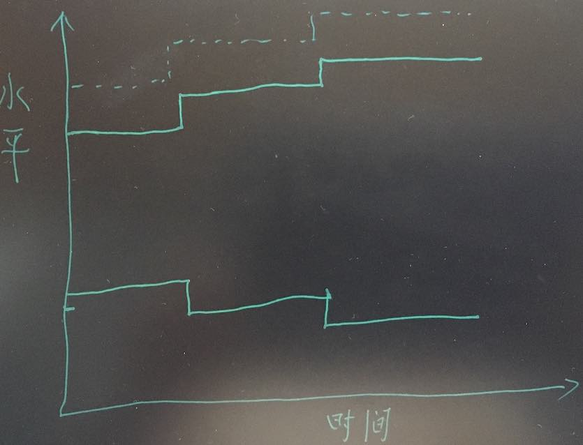

# 上线与下线之间是我们的人生 - 我的三线人生哲学

对人生意义的思考始于好多年以前，人生似乎处处痛苦，对如何快乐愉悦地生活，我求解于宗教，哲学，心理学，最后也只能一丝苦笑，可能答案本来就因人而异，怎么可能有放之四海而皆准的标准？真是念书念傻了吧。而针对愉悦生活的思考又是人不可回避的难题，每当我们受挫的时候那种灰心丧气的感觉怎么恢复？我觉得要么靠时间去遗忘，要么用自己的人生哲学去想通，前者是“把自己灌醉”，后者才是我认为的正道。最近工作里的一些事情不太顺，逼着你去思考，但这次似乎有所得，找到了一些至少适用于我的想法，就在这里记录一下吧。

## 上线与下线

下面这张图的纵坐标表示人在某一方面的水平，例如我们可以把它想为人的职业能力，人的长跑能力，道德水平，物质生活水平......等等吧。  
  
图1: 三线  

在这图中有三条线：  
+ 上线  
上方实线代表我们自己可以达到的最高水平。如果拿考试分数来举例子，那么这条线就是自己发挥最好时能够得到的分数。
+ 下线  
下方实线是我们自己能够理解和接受的最低水平。还是拿考试分数来说，那么这条线就是那条自己心里那条定义“考砸了”的线。这里要强调“能理解和接受”，也就是说如果把我们放到那个水平去，我们自己不会彻底垮掉，不会不能理解，不会失掉向上的信心。  
+ 虚线  
虚线代表我们生活工作中正在奋斗去到达的水平，它反应了我们心中的目标。所谓目标是我们愿意用实际行动去实线的东西，它区别于白日梦和过于不切边际的梦想。

人生起伏，三条线的位置随之波动，苦从何来？乐又从何来？在我看来全凭人的心态。贫穷的人不一定痛苦，富裕的人也不一定快乐，看你怎么合理安放这三条线。  

## 人生的厚度  
上线与下线之间是我们的生存“空间”，它的范围我视为“人生厚度”。  
  
图2: 人生厚度  

现实低于了一个人的下线会出问题，轻则愤世嫉俗，整日抱怨连天；重则疯癫，干脆结束生命。而现实高于上线也未必让人幸福，请脑补一下那些中了大奖最后悲惨一生的例子。所以说我们每天忙忙碌碌，其实也不过活在自己的这两线之间。 ***我们该追求更高的人生厚度***，更高的厚度等于更大的空间，它给了我们更多的回旋余地，有谁不想生活给自己的空间更大一点儿呢？ 

### 人生的厚度是我们挑战虚线的底气  
世间万物都在波动，大到社会，小到个人，只是范围不同而已。作为一个社会细胞，我们每个人都在不断追求更好，努力取得更好的成绩，过更好的生活，也就是挑战虚线。在这个过程中失败在所难免，每次失败都会使我们现状向下线移动，虚线越高，我们付出的就越多，每次失败带来的损失也就越大，只有更高的厚度才能让我们在挑战更高目标时不破下线，从而有机会东山再起。  

什么是脆弱？脆弱就是过小的人生厚度，经不起风雨，只能活在很小的那个空间里。如果网课结束，复学考试就可以让那么多小学生跳楼自杀，家长们就需要反思自己为什么只给了孩子那么窄的空间呢？ 

### 人生的厚度是幸福的基础  
我们常常说某某某面对困难和压力从容不破，永远笑口常开，不知她/他怎么做到的所以我们的敬仰把他们推上神坛。在我看来是人生的厚度让他/她能屈能伸，品的了山珍海味，也咽得下粗茶淡饭。过薄的厚度稍有波动就让我们焦虑不安，何谈快乐？

### 拓展人生厚度不止是推高上线  
我们从小被灌输奋斗的思想，通过奋斗我们不断向上拓展，推高上线，有效增强厚度......等等，这里好像少了什么，对，厚度的增大与否还要看在这个过程中下线怎么变。这往往被人所忽略，至少以前的我并没有充分意识到。***保持或压低下线同样必要***但我们看到更多的是能上不能下的主儿。毛主席面对来自国外的压力时曾谈笑风生地说过“大不了我们回去打游击嘛”的话，何等从容，而现如今环境好了，却竟是些握着权利不放，瞻前顾后的老爷，过不了苦日子了呗。

以前看过一则关于姜文的报道，他有一段时间什么都不干了，带着自己的儿子到西北农村一住就是半年。不知真假如何，如果确有此事那我觉得他还真是明白人，现在的孩子下线太高了，严重压缩了人生可能的厚度, 这将是他们走的更高的最大障碍。

## 愉悦人生  
怎么不负老天给的一世时间，愉快过一生？我们只谈论自己能控制的那部分，地球爆炸，世界大战开打，别人的妒忌杯葛等，都显著影响我们的幸福但我们什么也改变不了，那就不谈了。即便如此这还是个很难回答的问题，每个人的愉快都不同，这是一个相对的事情，寻求标准答案将是徒劳的。我想无论我们在社会中的角色是什么，地位高与低，如果能调整好自己在各个方面的三条线相对位置，每个人都会获得快乐人生。下面我通过排除法，看看一些让我们不快乐的因素，来阐述我的三线人生哲学。  

+ 欲壑难填  
人生在世，累的感觉纠缠我们良久，很多的苦都是自己逼出来的，反应在三线图上大概就是如下的形态，虚线离我们的上线太远了，这个距离和上下线距离的比例往往过大。有梦想是很幸福的事情，但日复一日的被梦想驱使是件很恐怖的事情：当我们花了十几年几十年完成了自己的梦想，回首一看尽是痛苦的经历那着实没什么可以高兴的，生命可没有给我们几个没病没灾的十年。  
  
图3:虚线过高    

+ 焦虑，脆弱，玻璃心  
不知什么时候起，焦虑成了人们的日常。屁民为生计焦虑，当官的为仕途焦虑，父母为孩子教育焦虑，单位领导为项目为属下焦虑。脆弱似乎是我们对下一代的共识，其实我们自己不也弱不禁风？看看那逐年走高的自杀率吧，越来越多的人可以接受死而不敢活下去。***过窄的人生厚度是造成焦虑和脆弱的原因。***  当生活的波动把我们的现实处境推向下线时，焦虑是自然的，为了避免它，唯一的对抗手段是让自己的下线更低一点，不被轻易逼近，也就不被轻易打破，所以我们还可以有信心地生活。  
  
图4：厚度过窄    

+ 尖酸刻薄，忌贤妒能  
每个人都有自己的三线，每个组织每个社会也都会有，当我们用自己的三线去和其他人进行不当对比时，就会产生负面影响。例如自己的下线高于了对方的上线，我该以怎样的心态去处理？很多人的刻薄就是由此而来的；当我们的上线低于对方的上线甚至下线，我们该如何面对？是不是应该放弃嫉妒，见贤思齐。这部分内容对于如何更好存活在一个组织内部挺有帮助，我想组织一下在另一篇中展开。  

其实还可以有好多例子，很难把所有场景都列举完。比较理想的三线人生应该是这样的：
+ 生活中可能发生在我们的身上的事情，大多数都能在上线与下线之间。即使坏的事情发生了，我们还是***能接受得了并不因此丧失信心***。由此可见，我们既要努力推高上线，也要刻意保持或拓展下线。  
+ 控制欲望，***让虚线处在我们经过阶段性（而不是一辈子）努力就可以触及的高度***；达成后要自己享受成功的喜悦，调高上线，之后可以继续设立新目标。  

让我们更快乐的三线分布：  
  
图5：首选 - 抬升上线，拓展下线  
  
图6：次选 - 抬升上线，小幅抬升下线  

## 未完待续 - 在组织机构中的应用  
我们生活在各种各样的社会组织中，我们的三线会和别人的三线出现碰撞，怎么能利用三线人生哲学更好规避问题，推动进步呢？我还在想 :-D, 过段时间再来分享。