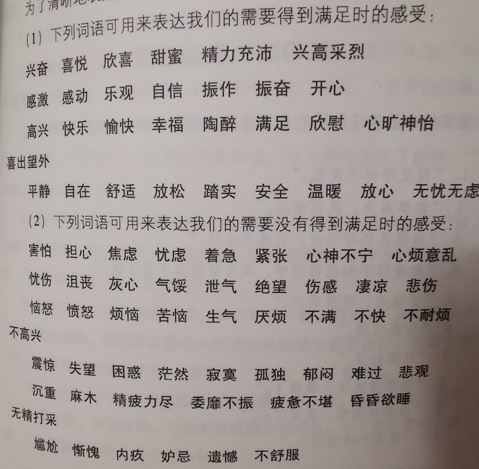

# 非暴力沟通

最近很忙，但还是抽时间把这本书读完了，感觉这个时间花的很值得啊。作者Marshall B.Rosenberg把自己总结的一种有效交流方式通过这本书与世人共享，中文版全书也才190页，可以说很好读，书页质地很好，纸张厚实光滑有韧性，让人爱不释手，基本上是两天一口气读完的。  

全书分章节讲解了一个简单易记的交流模式的各个环节，这个模式如下所述：***首先认真观察，如实描述实际情况而不掺杂个人判断或评估；接着我们认真表达自己的感受，注意感受不等于我们个人的想法；然后思考是我们自身的什么需求，触发了该感受；最后根据我们的需求，提出满足它的要求。***  
以上是当我们自己向别人表达时如何应用非暴力沟通，这个模式还可以“反着用”：当别人向我们表达时，我们用这个模式引导他/她按照上面这个步骤完成交流，从而达到更好的交流目的。所谓正反，其实就是关注***自己的感受和需求***，和关注***他人的感受与需求***。  

## 非暴力沟通的核心思想 - 我的理解  
我感觉很清楚：***一个人自身的各种需求是其感受的决定因素***，而不是他人他物。例如我高兴，那是由于我的某个需要被很好地满足；我生气，则正相反；我对他人不满，一定是他的某些行为破坏的我的某个重要需求。这很有道理。  

作者同时强调：”如果我们只想改变别人，以使得他们的行为符合我们的利益，那么非暴力沟通并不是合适的工具。NVC是在诚实和倾听的基础上建立人与人之间的关系“。 所以它立足在真诚交流，而不是给人洗脑。  

## “异化的沟通方式”  
+ 道德批判  
用道德标准来评判别人，如果其行为不符合我们的需要，就说其不道德  
+ 进行比较  
+ 回避责任  
把我们为满足自己需求而做的一些错误行为，归咎于外界。经常用“不得不”之类词汇  
+ 强人所难  
直接或间接威胁对方，暗示其不按照自己想法行事将面临惩罚  

异化的沟通方式阻碍了人与人之间建立友爱的关系，使得人与人之间的交流处在不信任的前提下。  

## 环节1: 要表达客观“观察”，不要“评判”  
NVC第一个要素是观察。我们要仔细观察，并如实描述观察的结果，不要加入自己的判断。例如“米奇花钱大手大脚”这是评论，“上个月米奇花了1000元买书”这是观察；“她长得很丑”是评论，“她对我没有吸引力”是观察。  

## 环节2: 要“感受”，不要“想法”  
NVC第二个要素是表达自己的感受。而人们在表达感受的时候往往变成说自己的想法，想法不等于感受。“我觉得我的吉他弹得不好”这个就是想法，“作为吉他手，我有些抑郁”这个是感受。 表达感受可以让对方更体会我的心情，增进了解。一些用于表达感受的词汇表如下：  
 

## 环节3: 寻找感受的根源 - 我们的某项需求  
在获得了自身感受后，我们需要继续思考是***我们自身的什么需求***促使这种感受的产生。这里提出当我们听到不中听的话时，可能有的4中选择：  
+ 自责  
+ 指责他人。以批评的方式提出主张，得到的只能是反抗  
+ 体会自己的感受，思考自己的需求。“我的感受是什么？我的什么需求被这些话伤害了？”    
+ 体会他人的感受，思考他人的需求。”是什么促使对方说这些话？“  

这里作者还描述了从“情感的奴隶”到“生活的主人“的过程 （这一段引起我的强烈共鸣，总结得太好了）：  
+ 最开始我们是”情感的奴隶“  
迎合他人特别是亲近的人，不希望他人不满，使得自己很累，甚至主动结束这种亲近关系。这种阶段的人比较抗拒建立亲密关系  
+ 然后我们进入”面目可憎“阶段  
我们发现”迎合他人简直太累了“，干脆不顾及他人感受了，变得比较冰冷，”面目可憎“。  
+ 最后我们成为”生活的主人“  
这个阶段我们出于友爱去帮助别人，而不是内疚，恐惧。是自由快乐的行为。我们意识到我们对自己的意愿，感受和行为负责，但无法为他人负责；人人相互依存，损人不能真正利己。  

## 环节4: 提出请求  
这里强调给出***具体的要求***， 而不是抽象的。例如”我需要体贴入微的关照“就比较抽象，别人不知道做什么，而”这周晚饭你来做“就更具体。另外我们***不要用命令替代请求***，而一旦对方认为不满足我们的请求就会收到惩罚时，请求就变成了命令。  
提请求过程也需要确认对方感受，了解对方的反馈  

## 倾听的技巧  
倾听是NVC的重要支柱，我们可以使用如下技巧：  
+ 体会他人的感受和需要  
+ 过程中给他人反馈，指把我们理解到的感受和需求反馈给对方  
+ 全程保持关注  
+ 当我们自己没有办法倾听时，明确提出来，让对方知道现在不行  

## 善待自己  
我们需要爱护自己，善于与自己和解。当我们表现不完美时，***我们要关注我们的那些需求被自己的行为破坏了***，而不是不停自责。  
用”我选择做______,是因为我想要______"句式去理解我们在生活中的行为，把焦点拉回自己，拉回自己的需求。  

## 充分地表达愤怒  
人为什么会生气？作者认为是人在听到不中听的话时，选择了第二种应对方式：指责他人。“我生气是因为他们......“。  
如何合理的充分的表达愤怒？需要提醒自己”我生气是因为我需要......"。

表达愤怒的4个步骤：  
+ 停下来，除了呼吸，什么都不做  
+ 想一想，是什么想法使得我们生气？  
+ 思考自己想要满足的需求  
+ 最后，明确表述出我的感受和需求  

## 如何表达感激  
NVC鼓励明确表达自己的感激，但表达内容不能太空洞，这样对方自己都不自信。正确的表达方式：  
+ 对方做了什么事情使得我们的生活得到改善  
+ 我的什么需求得到了满足  
+ 我现在的感受是什么
