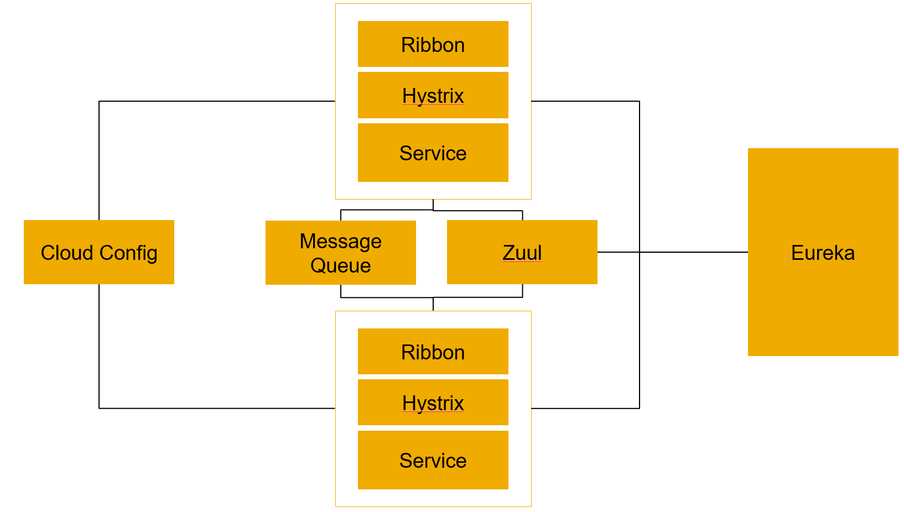
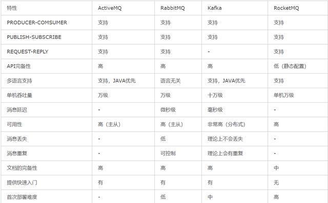

# Spring Cloud总结 （增强中）

SAP有自己的微服务开发框架，我们日常开发工作都是在这套机制下进行的，但SAP Cloud Platform本身是Cloud Foundry的，和Pivitol的Cloud类似，那么Spring Cloud这一套技术上也是行得通的，所以我想了解一下Spring Cloud这一套，博采众家之长嘛。

先看一下概览图，这个图我会满满丰富起来，目前是看到如下模块
  

以上这个构架，是没有Cloud Foundry这种基础设施的情况下也可行的，如果有了CF，那么服务的注册就CF自带了，每个应用服务都可以通过环境变量获知可用的其他服务；而服务的消费则可以考虑Spring的Cloud Connector项目中的各种服务连接器，它们能自动感知环境变量上给出的其它服务从而调用，所以有没有Cloud Foundry构架上会稍有不同。

上面这个构架的话搭配Cloud Foundry二者有重叠的成分，但是搭配容器以及容器编织技术（Kubernetes等）的话就很合适了，容器编织不会像Cloud Foundry一样大力提供微服务基础设施（如服务注册），这还是留给Cloud Application自己了。

### Eureka - 服务治理  
1. 服务注册  
维护了一个服务列表。Cloud整个体系内各个部件（如API网关，普通服务）都会再这个服务列表里面出现。

2. 服务发现  
不同的部件可能需要通过Eureka来发现和自己相关的其它部件。例如一个微服务需要消费另外一个微服务，API网关需要了解体系内所有的其它服务。凡是有类似需求的时候，Eureka都是提供者。

3. 服务消费  
服务被发现后，接着就是要消费它，那么具体的技术信息就变得必要，这些信息也是来自Eureka

### Zuul – API网关  
1. 解耦微服务  
微服务之间完全可以直接调用对方，或者通过Eureka来先寻找再调用进行简单的解耦，但API网关可以做更的更强大，它可以通过路由设置把诸如Load Balance等因素考虑进来，从而达到更高的健壮性。

2. 集中公共处理  
例如鉴权和身份验证这些过程是所有微服务都要有的，在每个服务中都重复的话过于低级了。API网关可以把这类事情集中起来处理，为所有微服务服务。

Zuul中自动使用了Ribbon和Hystrix，如果路由是通过service id指定的话，这两个机制自动生效。

### Cloud Config  
1. 集中配置  
从微服务外部提供配置，集中管理这些配置，配置分散的话改起来比较吃力，例如一个服务多个实例，那么我要改一个配置的话岂不是每个实例都要去改，显然不可以接受。集中配置提供了一种可能性，一旦我在这里做了改动，那么这些改动会被所有相关方共享。

2. 动态配置  
改配置是不是需要从起服务？是的话就不太理想，Spring的Cloud Config模块是有热加载的机制的，可以实现不停机而使得配置生效。这里生效是指配置内容被同步入相关微服务本地（例如放到它的application.properties）中，这个配置是不是在下一次被调用时生效那肯定和系统实现有关系的，例如一个配置我只在服务启动时候读一次，以后沿用读到的值，那么无论如何是需要重启的。

### Message Queue - 消息总线  
所谓Spring消息总线其实很简单，Spring只是把一个支持AMQP的MQ包一下，供微服务之间传递信息所用，所以其本质上就是一个Message Broker而已，作用：  
1. 解耦微服务，异步化处理    
这是解耦微服务的另外一种方式，同时达到异步处理的效果。通过Message Broker，生产者和消费者之间的处理异步化，这样系统灵活性也更高。
不要小看小小的Message Broker，它带来的是软件体系结构的变化，这种影响是相当深远的。

2. 削峰  
当服务请求集中到来时，负责应对的服务可以按照自己的步调从Message Queue中拿请求做处理

3. 达到“最终一致性”  
也可以说是给失败处理多次机会。我们的系统被划分成了诸多微服务，某些处理会跨服务进行，那么一致性如何保证呢？传统的一致性方式是很难达到的，所以我们放宽一步，只要求最终一致性：经过一段时间后并在某些事情发生前一定要达到一致。正是由于有了MQ，我们的一个服务处理某个请求时失败了，那么还有第二次机会，从而更好的符合最终一致性要求  

4. 链接异构微服务  
在我们的项目中就可以出现各种实现技术（java，nodejs等等）做的微服务，因为它们的交互完全由Message Broker代理了

这里附一个各种Message Broker的对比表格吧，来源网络  

### Hystrix - 容错处理  
驻留在微服务内，提供：  
1. 断路器，服务升降级  
当我们所依赖的服务出现异常时，如何保证我们自己服务的稳定？断路器要求我们的服务以一种React的模式去编写依赖逻辑，这样就先天性地会考虑服务不到位时如何处理。断路器内部有收集针对服务的调用情况统计，从而能决定该服务健康状态，进而做出降级甚至断开的决定

2. 服务隔离  
首先一个问题是我们应该如何调用被依赖的服务，在当前线程调用还是另起线程？如果是在当前线程直接调用，那么如果我们自己的服务被并发调用，那么被依赖服务也将会被等量调用，那么对方可能被压垮了从而造成失败，当然对我们自己服务来说，也会有坏处，例如无休止的等待。Hystrix针对每个服务引入了线程池（另外还有针对每个服务的信号量），来把每个服务“隔离”开来，从而能控制在各个服务上的并发操作。

### Ribbon – 客户端负载均衡  
一个微服务可能有多个提供者（instance），那么客户端（可能是一个微服务）在调用这个微服务时，主动考虑针对那个服务进行负载均衡。当然由于客户端不知道对方服务的真实情况，所以只能基于猜测，例如简单的交替轮换去访问所有服务instance。
Spring的Ribbon提供的客户端均衡真的是很傻瓜式的，它都集中在了RESTTemplate的实现逻辑中，使用者只需注入RESTTemplate实例的时候加一个注解。
在Spring提供的API网关Zuul中，已经自动使用了Ribbon以及断路器等机制。
